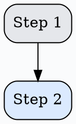

# MDX Documentation Patterns

## When to Use This Skill

- Creating new documentation pages
- Editing existing MDX content
- Adding images or components to docs
- Reviewing documentation for consistency

## File Location

All documentation lives in `src/content/docs/` as `.mdx` files.

## Required Frontmatter

Every MDX file MUST start with YAML frontmatter:

```yaml
---
title: Your Page Title
description: A brief description of what this page covers.
---
```

Both `title` and `description` are required.

## Import Patterns

### Images

```mdx
import { Image } from "astro:assets"
import myScreenshot from "../../images/section/screenshot.png"

<Image src={myScreenshot} alt="Description of image"/>
```

- Images go in `src/content/docs/images/` subdirectories
- Always provide alt text
- Use relative paths from the MDX file

### Custom Components

```mdx
import IntegrationLogo from "../../../components/IntegrationLogo.astro"
import CustomComponent from "~/components/CustomComponent.astro"
```

- Astro components use `.astro` extension
- React components use `.tsx` extension
- Prefer `~/` path alias for deep imports

## Callout Boxes (Asides)

Use the directive syntax for callouts:

```mdx
:::note
  Important information the reader should know.
:::

:::tip
  Helpful suggestion or best practice.
:::

:::caution
  Warning about potential issues.
:::

:::danger
  Critical warning about destructive or irreversible actions.
:::
```

**Important:** Content inside directives should be indented with 2 spaces.

## Graphviz Diagrams

The site supports Graphviz diagrams via remark-graphviz:

`````mdx

`````

## Content Structure

### Heading Hierarchy

- Start with `## H2` headings (H1 is auto-generated from title)
- Use `### H3` for subsections
- Avoid going deeper than H4

### Internal Links

Use relative paths or absolute paths from site root:

```mdx
See the [queue command](/commands/queue) for details.
Check out [merge queue rules](/merge-queue/rules/#auto-queueing-pull-requests).
```

### Code Blocks

Syntax highlighting is automatic with Shiki:

`````mdx
```yaml
# Mergify configuration example
queue_rules:
  - name: default
    merge_conditions:
      - check-success=ci
```
`````

## File Organization

```text
src/content/docs/
├── merge-queue/           # Merge queue section
│   ├── lifecycle.mdx
│   ├── priority.mdx
│   └── rules.mdx
├── workflow/              # Workflow automation
│   ├── actions/          # Individual actions
│   │   ├── queue.mdx
│   │   └── comment.mdx
│   └── rule-syntax.mdx
├── integrations/          # Third-party integrations
├── commands/             # GitHub comment commands
└── images/               # All documentation images
    ├── merge-queue/
    └── integrations/
```

## Anti-Patterns to Avoid

### Wrong: Missing frontmatter
```mdx
# My Page Title

Content here...
```

### Wrong: Hardcoded image paths
```mdx

```

### Wrong: Non-indented directive content
```mdx
:::note
Not indented - may cause issues.
:::
```

### Wrong: H1 headings in content
```mdx
# Don't use H1

Use ## H2 instead since title becomes H1.
```

## Example: Complete Documentation Page

`````mdx
---
title: Integrating Example Service with Mergify
description: How to connect Example Service to your Mergify workflow.
---

import { Image } from "astro:assets"
import exampleLogo from "../../images/integrations/example/logo.svg"
import IntegrationLogo from "../../../components/IntegrationLogo.astro"
import setupScreenshot from "../../images/integrations/example/setup.png"

<IntegrationLogo src={exampleLogo} alt="Example Service logo"/>

Example Service provides additional functionality for your CI/CD pipeline.

## Prerequisites

Before getting started, ensure you have:

- A Mergify account with the repository enabled
- An Example Service account

:::note
  This integration requires admin access to your repository.
:::

## Setup Steps

### Step 1: Generate API Token

Navigate to your Example Service settings and create a new API token.

<Image src={setupScreenshot} alt="Example Service setup screen"/>

### Step 2: Configure Mergify

Add the following to your `.mergify.yml`:

```yaml
queue_rules:
  - name: default
    merge_conditions:
      - check-success=example-service
```

## Troubleshooting

:::caution
  If checks are not appearing, verify your API token has the correct permissions.
:::

See the [configuration reference](/configuration/file-format) for more options.
`````

## Integration with Other Skills

- Review content with project code style guidelines
- Run `npm run build` to verify MDX compiles correctly
- Check broken links with `./scripts/detect-broken-links.sh`
