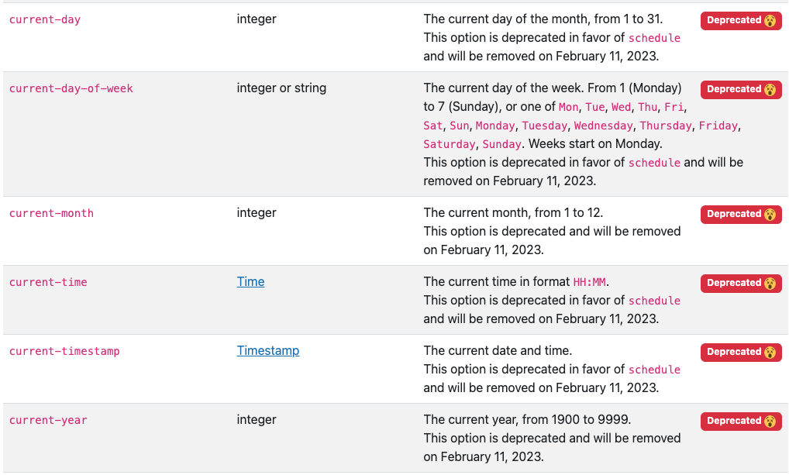

The attributes `current-day`, `current-day-of-week`, `current-month`, `current-time`, `current-timestamp` and `current-year` are deprecated and will be removed on February, 11th 2023.

We recommend using the `schedule` condition instead.

