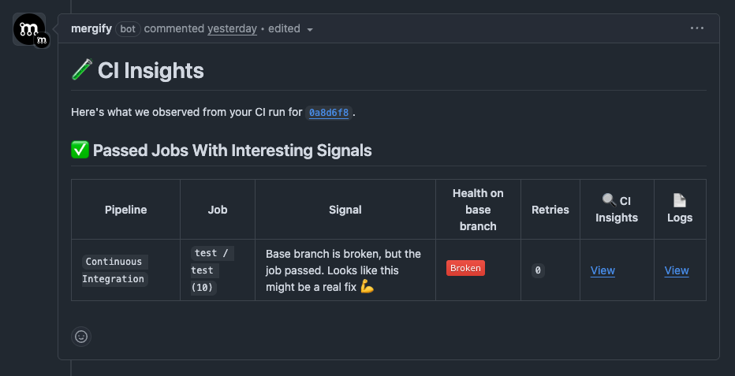

CI Insights now automatically posts a summary comment on every pull request, giving your team instant visibility into:

- Failed jobs and flaky test detections
- Total execution time and CI health
- Quick insights without leaving the PR

This helps reviewers and authors catch issues faster and understand CI behavior at a glance — without having to dig into external dashboards.

