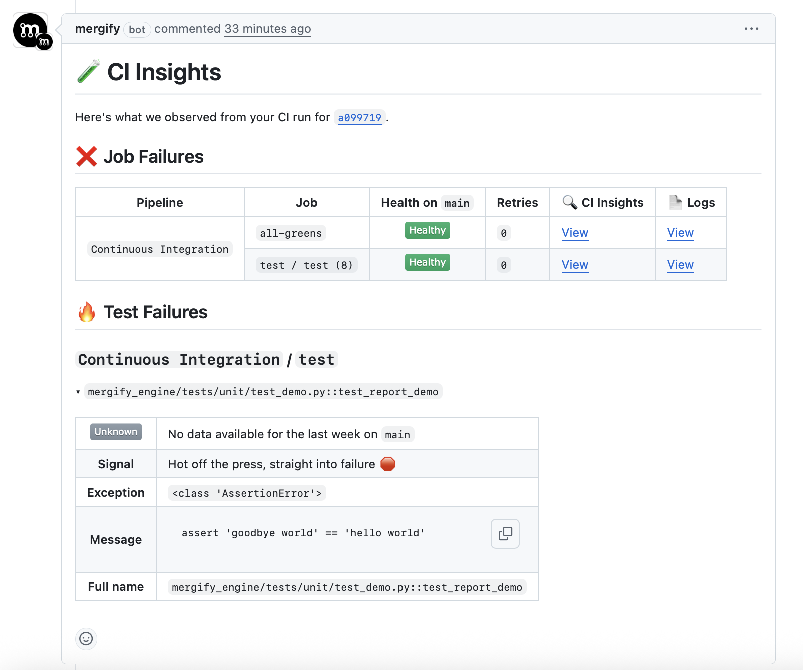

We’ve expanded the information included in PR comments from CI Insights.

Previously, comments only reported **job-level results** (success, failure, retries).

Now, they also include **test-level insights**:

- Failed tests are listed directly in the PR comment.
- Flaky tests are highlighted with their recent history.
- Linked details let you jump into CI Insights for deeper investigation.

This makes it easier for developers and reviewers to see exactly *which tests* failed without digging into raw CI logs — saving time and reducing context switching.

