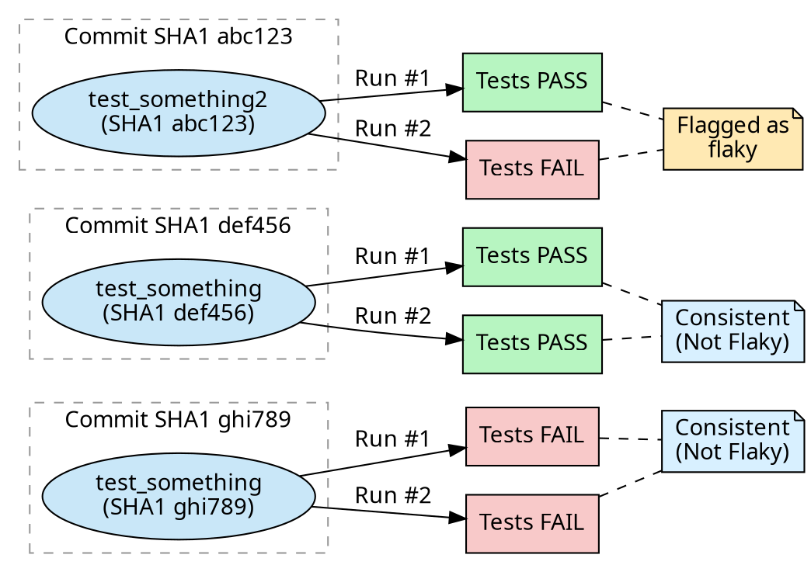

import { Image } from "astro:assets"
import Docset from '../../../components/DocsetGrid/Docset.astro'
import DocsetGrid from '../../../components/DocsetGrid/DocsetGrid.astro'
import { SiGithubactions, SiJenkins } from 'react-icons/si'

Flaky test detection helps you identify tests that produce inconsistent results
on the same code, allowing you to improve the reliability of your test suite
and reduce false positives in your CI pipeline.

## Understanding Flaky Tests

A **flaky test** is one that has different conclusions on the same SHA1. For
example, if a test runs twice on the same commit and once fails while the other
succeeds, it's considered flaky because the outcome is not consistent with the
same code.

Below is a simplified visualization of flakiness: two executions of the same
tests on the exact same commit (same SHA1) produce different results. This
inconsistency is what flags the test as flaky.

Flaky tests are problematic because they:

- Create false positives that block legitimate deployments
- Reduce confidence in your test suite
- Waste developer time investigating non-issues
- Can mask real bugs when they fail intermittently

## How Flaky Detection Works

Flaky test detection works by running your test suite multiple times on the
same commit. When tests produce different results (pass/fail) across these runs
on identical code, they are flagged as flaky. This approach helps identify
tests that are unreliable and may cause false positives or negatives in your CI
pipeline.

## Setting Up Flaky Test Detection

See CI‑specific setup guides:

<DocsetGrid>
  <Docset title="GitHub Actions"
          path="/ci-insights/setup/github-actions#setting-up-flaky-test-detection" icon={SiGithubactions}>
    Configure scheduled/matrix or looping runs and upload reports.
  </Docset>
</DocsetGrid>

## Interpreting Flaky Test Results

Once your flaky test detection is running, CI Insights will analyze the results
and identify patterns:

### In the CI Insights Dashboard

1. **Tests View**: Navigate to the Tests section in CI Insights to see tests flagged as flaky
2. **Consistency Metrics**: View the success/failure ratio for each test across multiple runs
3. **Timeline Analysis**: See when flakiness was first detected and how it trends over time
4. **Impact Assessment**: Understand which tests are causing the most CI instability

### What to Look For

- **High Flakiness Rate**: Tests that fail inconsistently across runs on the same commit
- **Recent Flakiness**: Newly introduced flaky behavior that may indicate recent code changes
- **Critical Path Tests**: Flaky tests in important workflows that could block deployments
- **Patterns**: Flakiness that occurs under specific conditions (time of day, load, etc.)

### Taking Action

When flaky tests are identified:

1. **Prioritize by Impact**: Focus on tests that affect critical workflows
   first

2. **Investigate Root Causes**: Look for timing issues, external dependencies,
   or race conditions

3. **Improve Test Reliability**: Add proper waits, mocks, or test isolation

4. **Monitor Progress**: Use CI Insights to verify that fixes reduce flakiness
   over time

## Common Causes of Flaky Tests

Understanding common causes can help you fix flaky tests more effectively:

### Timing Issues

- **Race conditions**: Tests that depend on timing between operations

- **Insufficient waits**: Tests that don't wait long enough for operations to
  complete

- **Timeouts**: Tests with hardcoded timeouts that may vary in different
  environments

### External Dependencies

- **Network calls**: Tests that make real HTTP requests
- **Database state**: Tests that depend on specific database state
- **File system**: Tests that read/write files without proper cleanup

### Test Isolation

- **Shared state**: Tests that affect each other's state
- **Order dependencies**: Tests that only pass when run in a specific order
- **Resource conflicts**: Tests competing for the same resources

### Environment Variations

- **System load**: Tests sensitive to CPU or memory usage
- **Date/time dependencies**: Tests that depend on current time
- **Random data**: Tests using non-deterministic random values

## Best Practices for Reliable Tests

To prevent flaky tests:

1. **Use deterministic data**: Replace random values with fixed test data
2. **Mock external dependencies**: Isolate tests from network, database, and file system
3. **Implement proper waits**: Use explicit waits instead of fixed sleeps
4. **Clean up after tests**: Ensure each test starts with a clean state
5. **Make tests independent**: Each test should be able to run in isolation
6. **Use stable selectors**: In UI tests, use reliable element selectors
7. **Handle async operations**: Properly wait for asynchronous operations to complete
