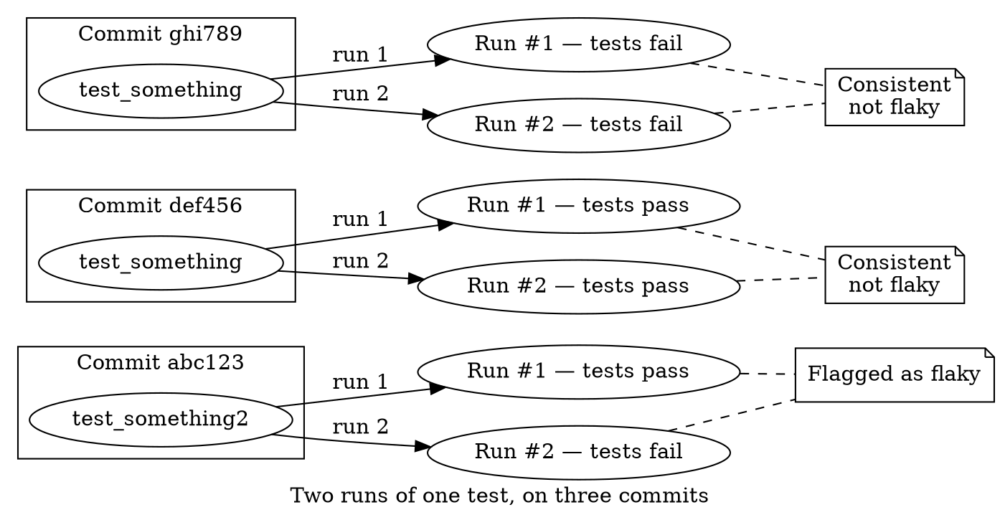

import { Image } from "astro:assets"
import Docset from '../../../components/DocsetGrid/Docset.astro'
import DocsetGrid from '../../../components/DocsetGrid/DocsetGrid.astro'

Flaky test detection helps you identify tests that produce inconsistent results
on the same code, allowing you to improve the reliability of your test suite
and reduce false positives in your CI pipeline.

## Understanding Flaky Tests

A **flaky test** is one whose outcome doesn't follow from the code alone.
Mergify looks for either of two signals: repeated runs of the same commit
(SHA1) in the same pipeline and job disagree, or the test both passed and failed
within the same hour on the same branch, pipeline, and job. A failure has to be
part of the disagreement, so a test whose results differ without ever failing,
such as one that is skipped in one run and passes in another, stays healthy. A
test that only ever fails is reported as broken rather than flaky, since no run
contradicts the failures.

A signal on its own isn't enough. Failures that make up a very small share of a
test's executions leave it healthy, and a test goes back to healthy once it has
kept running, and passing, for a week after its last failure.

Below is a simplified visualization of repeated runs on one commit: two
executions of the same tests on the exact same commit (same SHA1) produce
different results.

```dot class="queue"
digraph {
  label="Two runs of one test, on three commits";
  rankdir=LR;

  subgraph cluster_commit1 {
    class="batch";
    label="Commit abc123";
    commit1 [label="test_something2", shape=oval, class="config"];
  }
  run1 [label="Run #1 — tests pass", class="merged"];
  run2 [label="Run #2 — tests fail", class="failed"];
  detector [label="Flagged as flaky", shape=note, class="pending"];
  commit1 -> run1 [label="  run 1"];
  commit1 -> run2 [label="  run 2"];
  { rank=same; run1; run2; }
  run1 -> detector [class="muted", style=dashed, arrowhead=none];
  run2 -> detector [class="muted", style=dashed, arrowhead=none];

  subgraph cluster_commit2 {
    class="batch";
    label="Commit def456";
    commit2 [label="test_something", shape=oval, class="config"];
  }
  run3 [label="Run #1 — tests pass", class="merged"];
  run4 [label="Run #2 — tests pass", class="merged"];
  stable [label="Consistent\nnot flaky", shape=note, class="external"];
  commit2 -> run3 [label="  run 1"];
  commit2 -> run4 [label="  run 2"];
  { rank=same; run3; run4; }
  run3 -> stable [class="muted", style=dashed, arrowhead=none];
  run4 -> stable [class="muted", style=dashed, arrowhead=none];

  subgraph cluster_commit3 {
    class="batch";
    label="Commit ghi789";
    commit3 [label="test_something", shape=oval, class="config"];
  }
  run5 [label="Run #1 — tests fail", class="failed"];
  run6 [label="Run #2 — tests fail", class="failed"];
  stable2 [label="Consistent\nnot flaky", shape=note, class="external"];
  commit3 -> run5 [label="  run 1"];
  commit3 -> run6 [label="  run 2"];
  { rank=same; run5; run6; }
  run5 -> stable2 [class="muted", style=dashed, arrowhead=none];
  run6 -> stable2 [class="muted", style=dashed, arrowhead=none];
}
```

Flaky tests are problematic because they:

- Create false positives that block legitimate deployments
- Reduce confidence in your test suite
- Waste developer time investigating non-issues
- Can mask real bugs when they fail intermittently

## How Flaky Detection Works

Mergify compares each uploaded test result against the results it already holds
for the same test, on the same commit, in the same pipeline and job, and records
any disagreement. It also watches for a test that passed and failed within the
same hour on the same branch, pipeline, and job, which catches disagreements
whose two runs sat on different commits. Any repeat execution counts: a retried
job, a re-run workflow, or a job that runs the suite several times in a row.

Detection does not depend on the scheduled runs that the setup guides below
describe. Running your suite several times on the same commit produces the
evidence deliberately, on a schedule you choose, instead of waiting for a rerun
to expose the problem. Keeping the job name identical to the one used on your
pull requests matters for the same reason: results are only compared within a
single pipeline and job.

## Setting Up Flaky Test Detection

See CI-specific setup guides:

<DocsetGrid>
  <Docset title="GitHub Actions"
          path="/ci-insights/setup/github-actions#setting-up-flaky-test-detection" icon="simple-icons:githubactions">
    Configure scheduled looping runs and upload reports.
  </Docset>
  <Docset title="Jenkins"
          path="/ci-insights/setup/jenkins#setting-up-flaky-test-detection" icon="simple-icons:jenkins">
    Configure scheduled looping runs and upload reports.
  </Docset>
  <Docset title="Buildkite"
          path="/ci-insights/setup/buildkite#setting-up-flaky-test-detection" icon="simple-icons:buildkite">
    Configure scheduled looping runs and upload reports.
  </Docset>
</DocsetGrid>

## Interpreting Flaky Test Results

Once your flaky test detection is running, Mergify analyzes every uploaded
report and flags the tests whose results disagree on a single commit.

### Where the Results Appear

Test-level results live in [Test Insights](/test-insights), not in CI Insights:
its [Detection](/test-insights/detection) page lists the flaky and broken tests
found across your repositories and reports each one's
[impact](/test-insights/detection#prioritizing-with-impact): the share of its
executions that failed, as low, medium, or high.

Flakiness at the job level stays in CI Insights, on the
[Jobs](/ci-insights/jobs) page.

### What to Look For

- **High Flakiness Rate**: Tests that fail inconsistently across runs on the same commit
- **Recent Flakiness**: Newly introduced flaky behavior that may indicate recent code changes
- **Critical Path Tests**: Flaky tests in important workflows that could block deployments
- **Patterns**: Flakiness that occurs under specific conditions (time of day, load, etc.)

### Taking Action

When flaky tests are identified:

1. **Prioritize by Impact**: Focus on tests that affect critical workflows
   first

2. **Investigate Root Causes**: Look for timing issues, external dependencies,
   or race conditions

3. **Improve Test Reliability**: Add proper waits, mocks, or test isolation

4. **Monitor Progress**: Use CI Insights to verify that fixes reduce flakiness
   over time

## Common Causes of Flaky Tests

Understanding common causes can help you fix flaky tests more effectively:

### Timing Issues

- **Race conditions**: Tests that depend on timing between operations

- **Insufficient waits**: Tests that don't wait long enough for operations to
  complete

- **Timeouts**: Tests with hardcoded timeouts that may vary in different
  environments

### External Dependencies

- **Network calls**: Tests that make real HTTP requests
- **Database state**: Tests that depend on specific database state
- **File system**: Tests that read/write files without proper cleanup

### Test Isolation

- **Shared state**: Tests that affect each other's state
- **Order dependencies**: Tests that only pass when run in a specific order
- **Resource conflicts**: Tests competing for the same resources

### Environment Variations

- **System load**: Tests sensitive to CPU or memory usage
- **Date/time dependencies**: Tests that depend on current time
- **Random data**: Tests using non-deterministic random values

## Best Practices for Reliable Tests

To prevent flaky tests:

1. **Use deterministic data**: Replace random values with fixed test data
2. **Mock external dependencies**: Isolate tests from network, database, and file system
3. **Implement proper waits**: Use explicit waits instead of fixed sleeps
4. **Clean up after tests**: Ensure each test starts with a clean state
5. **Make tests independent**: Each test should be able to run in isolation
6. **Use stable selectors**: In UI tests, use reliable element selectors
7. **Handle async operations**: Properly wait for asynchronous operations to complete
