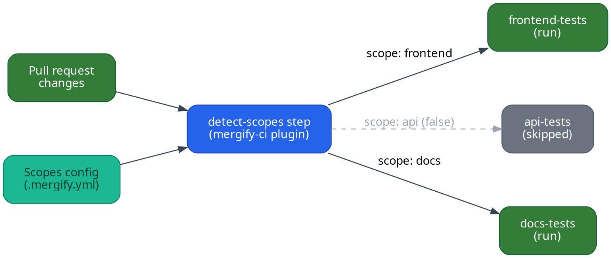

import buildkiteLogo from "../../images/integrations/buildkite/logo.svg"
import IntegrationLogo from "../../../components/IntegrationLogo.astro"

<IntegrationLogo src={buildkiteLogo} alt="Buildkite logo"/>

[Buildkite](https://buildkite.com/) is a CI/CD tool with pipeline orchestration
and self-hosted runners. Mergify has native integrations for Buildkite covering
CI Insights, Monorepo CI, and Merge Queue Scopes. Any Buildkite status check
reported to GitHub can also be referenced from your Mergify
[conditions](/configuration/conditions) via `check-success`.

## Prerequisites

1. Buildkite is properly set up and is building your projects. See the
   [Buildkite
   Documentation](https://buildkite.com/docs/tutorials/getting-started) for
   help with setting up Buildkite.

2. Buildkite is [configured to report build statuses to
   GitHub](https://buildkite.com/docs/integrations/github#connecting-buildkite-and-github).

3. The [Mergify GitHub App](/integrations/github) is installed in your repository.

## Mergify features for Buildkite

- **[CI Insights](/ci-insights/setup/buildkite)**: collect Buildkite job
  metrics, detect flaky tests, and get Slack notifications for CI failures.

- **[Monorepo CI](#monorepo-ci)**: skip unaffected steps on pull requests to cut
  CI spend in monorepos.

- **[Merge Queue Scopes](/merge-queue/scopes/others)**: run only the jobs
  affected by a batch when processing the merge queue. Examples for
  [Bazel](/merge-queue/scopes/bazel),
  [Nx](/merge-queue/scopes/nx), and
  [Turborepo](/merge-queue/scopes/turborepo) are available.

## Monorepo CI

Monorepo CI is [scopes](/merge-queue/scopes) applied to your pipelines. The same
`scopes` block that lets the merge queue batch by scope also tells your pipeline
which steps have work to do, so a pull request that only touches the frontend
does not pay for the API and docs test suites.

This section covers step skipping on pull requests. For smarter batching or
[parallel mode](/merge-queue/queue-modes#parallel-mode) in the merge queue,
scopes already do that on their own. See
[Merge Queue Scopes](/merge-queue/scopes).

Running GitHub Actions instead? The
[GitHub Actions integration](/integrations/gha#monorepo-ci) covers the same
ground. Scopes themselves are CI-agnostic, so for any other provider
[let us know](mailto:support@mergify.com) and see
[Merge Queue Scopes](/merge-queue/scopes/others).

### Declare your scopes

The plugin reads the `scopes` block of your `.mergify.yml` to know which areas
of the repository map to each scope name:

```yaml
scopes:
  source:
    files:
      frontend:
        include:
          - apps/web/**/*
      api:
        include:
          - services/api/**/*
      docs:
        include:
          - docs/**/*
```

### Pipeline outline

A Buildkite pipeline driven by scopes has two parts:

1. **Detect scopes** using the
   [`mergifyio/mergify-ci`](https://github.com/Mergifyio/mergify-ci-buildkite-plugin) plugin.

2. **Use a dynamic pipeline** to conditionally upload only the steps that match
   the affected scopes.



### Static pipeline entry point

```yaml
# .buildkite/pipeline.yml
steps:
  - label: ":mag: Detect scopes"
    key: detect-scopes
    plugins:
      - mergifyio/mergify-ci#@@BUILDKITE_PLUGIN_VERSION@@:
          action: scopes
          token: "${MERGIFY_TOKEN}"

  - label: ":pipeline: Upload conditional steps"
    depends_on: detect-scopes
    command: .buildkite/dynamic-pipeline.sh | buildkite-agent pipeline upload
```

### Dynamic pipeline script

The script below parses the scope results with
[`jq`](https://jqlang.github.io/jq/), so install it on your Buildkite agents
first.

```bash
#!/bin/bash
# .buildkite/dynamic-pipeline.sh
set -euo pipefail

SCOPES=$(buildkite-agent meta-data get "mergify-ci.scopes" --default '{}')

echo "steps:"

if echo "$SCOPES" | jq -e '.frontend == "true"' > /dev/null 2>&1; then
  cat <<'YAML'
  - label: ":react: Frontend tests"
    command: npm test
    plugins:
      - mergifyio/mergify-ci#@@BUILDKITE_PLUGIN_VERSION@@:
          action: junit-process
          report_path: "junit.xml"
          token: "${MERGIFY_TOKEN}"
YAML
fi

if echo "$SCOPES" | jq -e '.api == "true"' > /dev/null 2>&1; then
  cat <<'YAML'
  - label: ":gear: API tests"
    command: pytest tests/api/
    plugins:
      - mergifyio/mergify-ci#@@BUILDKITE_PLUGIN_VERSION@@:
          action: junit-process
          report_path: "reports/*.xml"
          token: "${MERGIFY_TOKEN}"
YAML
fi

if echo "$SCOPES" | jq -e '.docs == "true"' > /dev/null 2>&1; then
  cat <<'YAML'
  - label: ":books: Docs build"
    command: make docs
YAML
fi

# Buildkite rejects a pipeline with no steps, so emit a no-op when a pull
# request touches nothing in any scope.
if [ "$(echo "$SCOPES" | jq '[.[] | select(. == "true")] | length')" = "0" ]; then
  cat <<'YAML'
  - label: ":fast_forward: No affected scopes"
    command: "true"
YAML
fi
```

Make the script executable:

```bash
chmod +x .buildkite/dynamic-pipeline.sh
```

In this pipeline:

- The `detect-scopes` step calls the `mergifyio/mergify-ci` plugin with the
  `scopes` action, which inspects the pull request diff and stores a JSON map of
  scopes (`"true"` or `"false"`) as Buildkite meta-data under the key
  `mergify-ci.scopes`.

- The dynamic pipeline script reads the scopes meta-data and only emits the
  steps for scopes that are `"true"`, so unaffected steps are skipped entirely.

- Each test step can optionally use the `junit-process` action to upload test
  results to CI Insights.

### Triggering separate pipelines

If your monorepo builds live in separate Buildkite pipelines, use trigger steps
instead:

```bash
#!/bin/bash
# .buildkite/dynamic-pipeline.sh
set -euo pipefail

SCOPES=$(buildkite-agent meta-data get "mergify-ci.scopes" --default '{}')

echo "steps:"

if echo "$SCOPES" | jq -e '.frontend == "true"' > /dev/null 2>&1; then
  cat <<'YAML'
  - trigger: "frontend-pipeline"
    label: ":react: Trigger frontend pipeline"
    build:
      branch: "${BUILDKITE_BRANCH}"
      commit: "${BUILDKITE_COMMIT}"
YAML
fi

if echo "$SCOPES" | jq -e '.api == "true"' > /dev/null 2>&1; then
  cat <<'YAML'
  - trigger: "api-pipeline"
    label: ":gear: Trigger API pipeline"
    build:
      branch: "${BUILDKITE_BRANCH}"
      commit: "${BUILDKITE_COMMIT}"
YAML
fi

if echo "$SCOPES" | jq -e '.docs == "true"' > /dev/null 2>&1; then
  cat <<'YAML'
  - trigger: "docs-pipeline"
    label: ":books: Trigger docs pipeline"
    build:
      branch: "${BUILDKITE_BRANCH}"
      commit: "${BUILDKITE_COMMIT}"
YAML
fi

if [ "$(echo "$SCOPES" | jq '[.[] | select(. == "true")] | length')" = "0" ]; then
  cat <<'YAML'
  - label: ":fast_forward: No affected scopes"
    command: "true"
YAML
fi
```

Declare a trigger branch for every scope you define. A scope with no matching
branch produces a pull request that silently runs no checks at all.
