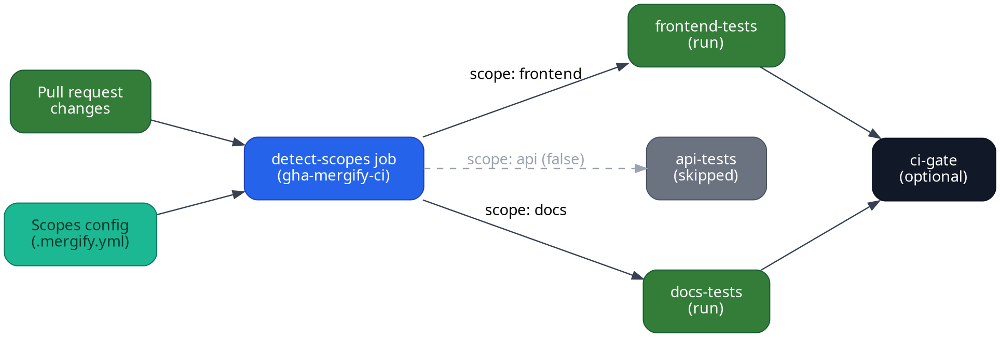

import { Image } from "astro:assets"
import ghaLogo from "../../images/integrations/gha/logo.png"
import ghaSummaryScreenshot from "../../images/integrations/gha/monorepo-ci-summary.png"
import IntegrationLogo from "../../../components/IntegrationLogo.astro"

<IntegrationLogo src={ghaLogo} alt="GitHub Actions logo"/>

[GitHub Actions](https://github.com/features/actions) is the CI/CD platform
provided by GitHub. Mergify has native integrations for GitHub Actions covering
CI Insights, Monorepo CI, and Merge Queue Scopes. Any GitHub Actions job status
can also be referenced from your Mergify
[conditions](/configuration/conditions) via `check-success`.

## Prerequisites

1. You've set up GitHub Actions in your repository. If you're new to GitHub
   Actions, see their
   [official documentation](https://docs.github.com/en/actions).

2. GitHub Actions is already configured to report job statuses to your pull
   requests.

3. The [Mergify GitHub App](/integrations/github) is installed in your repository.

## Mergify features for GitHub Actions

- **[CI Insights](/ci-insights/setup/github-actions)**: collect job metrics,
  detect flaky tests, and get Slack notifications for CI failures.

- **[Monorepo CI](#monorepo-ci)**: skip unaffected jobs on pull requests to cut
  CI spend in monorepos.

- **[Merge Queue Scopes](/merge-queue/scopes/others)**: run only the jobs
  affected by a batch when processing the merge queue. Examples for
  [Bazel](/merge-queue/scopes/bazel),
  [Nx](/merge-queue/scopes/nx), and
  [Turborepo](/merge-queue/scopes/turborepo) are available.

- **[`github_actions` action](/workflow/actions/github_actions)** (deprecated):
  trigger a workflow directly from a Mergify rule.

:::caution
  To match a GitHub Actions status check with `check-success`, use the job
  name only, not the workflow name.
:::

## Monorepo CI

Monorepo CI is [scopes](/merge-queue/scopes) applied to your workflows. The same
`scopes` block that lets the merge queue batch by scope also tells each job
whether it has work to do, so a pull request that only touches the frontend
does not pay for the API and docs test suites.

This section covers job skipping on pull requests. For smarter batching or
[parallel mode](/merge-queue/queue-modes#parallel-mode) in the merge queue,
scopes already do that on their own. See
[Merge Queue Scopes](/merge-queue/scopes).

Running Buildkite instead? The
[Buildkite integration](/integrations/buildkite#monorepo-ci) covers the same
ground. Scopes themselves are CI-agnostic, so for any other provider
[let us know](mailto:support@mergify.com) and see
[Merge Queue Scopes](/merge-queue/scopes/others).

### Declare your scopes

The action reads the `scopes` block of your `.mergify.yml` to know which areas
of the repository map to each scope name:

```yaml
scopes:
  source:
    files:
      frontend:
        include:
          - apps/web/**/*
      api:
        include:
          - services/api/**/*
      docs:
        include:
          - docs/**/*
```

### Workflow outline

A GitHub Actions workflow driven by scopes has three parts:

1. **Detect scopes** using the
   [`gha-mergify-ci`](https://github.com/Mergifyio/gha-mergify-ci) action.

2. **Reuse the scope outputs** to conditionally run jobs.

3. **Publish a final status** (for example with a `ci-gate` job) if you want one
   check that reflects all the jobs that ran.



### Example workflow

:::caution
  The `scopes` action requires a pull request context. If your workflow also
  triggers on `push` events, guard the scopes job with
  `if: ${{ github.event_name == 'pull_request' }}` to avoid failures.
:::

```yaml
name: Monorepo CI
on:
  pull_request:

jobs:
  detect-scopes:
    runs-on: ubuntu-24.04
    outputs:
      frontend: ${{ fromJSON(steps.scopes.outputs.scopes).frontend }}
      api: ${{ fromJSON(steps.scopes.outputs.scopes).api }}
      docs: ${{ fromJSON(steps.scopes.outputs.scopes).docs }}
    steps:
      - uses: actions/checkout@v5

      - name: Detect scopes
        id: scopes
        uses: Mergifyio/gha-mergify-ci@@@GHA_MERGIFY_CI_VERSION@@
        with:
          action: scopes

  frontend-tests:
    needs: detect-scopes
    if: ${{ needs.detect-scopes.outputs.frontend == 'true' }}
    uses: ./.github/workflows/frontend-tests.yaml
    secrets: inherit

  api-tests:
    needs: detect-scopes
    if: ${{ needs.detect-scopes.outputs.api == 'true' }}
    uses: ./.github/workflows/api-tests.yaml
    secrets: inherit

  docs-tests:
    needs: detect-scopes
    if: ${{ needs.detect-scopes.outputs.docs == 'true' }}
    uses: ./.github/workflows/docs-tests.yaml
    secrets: inherit

  ci-gate:
    if: ${{ !cancelled() }}
    needs:
      - detect-scopes
      - frontend-tests
      - api-tests
      - docs-tests
    runs-on: ubuntu-24.04
    steps:
      - name: Report status
        uses: Mergifyio/gha-mergify-ci@@@GHA_MERGIFY_CI_VERSION@@
        with:
          action: wait-jobs
          jobs: ${{ toJSON(needs) }}
```

In this workflow:

- `detect-scopes` calls `gha-mergify-ci` with the `scopes` action, which
  inspects the pull request diff and returns a JSON map of scopes set to `true`
  or `false`.

- Each job checks the scope it cares about before running, reducing redundant
  builds.

- The final `ci-gate` job ensures that the aggregated status reflects the actual
  CI coverage, even if some jobs were skipped. Keep `detect-scopes` in its
  `needs`: without it, a failed scope detection skips every test job and
  `ci-gate` still reports success.

Mergify also publishes annotations that can be seen in your GitHub Actions jobs
summary.

<Image src={ghaSummaryScreenshot} alt="GitHub Actions job summary listing the scopes detected for a pull request" />

### Protecting the branch with `ci-gate`

Once `ci-gate` publishes a single status, add it as a required check in your
GitHub branch ruleset so that only pull requests with the relevant jobs executed
can merge.
