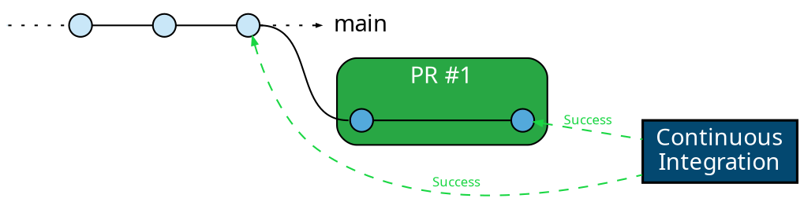
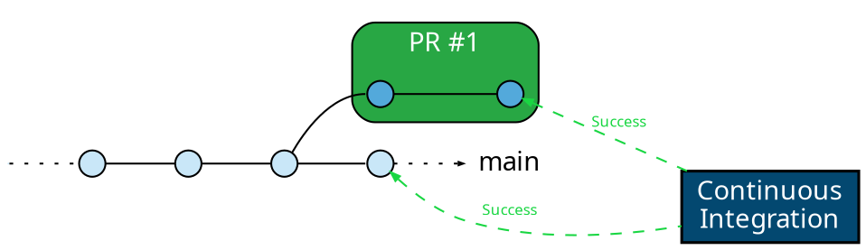
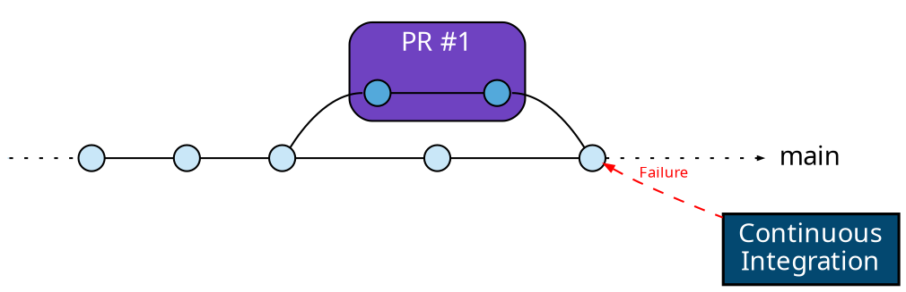
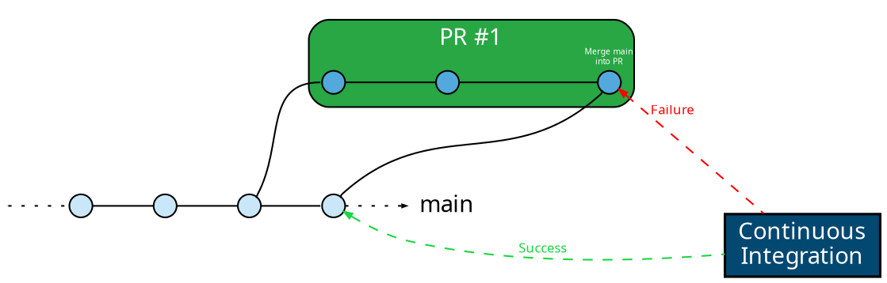
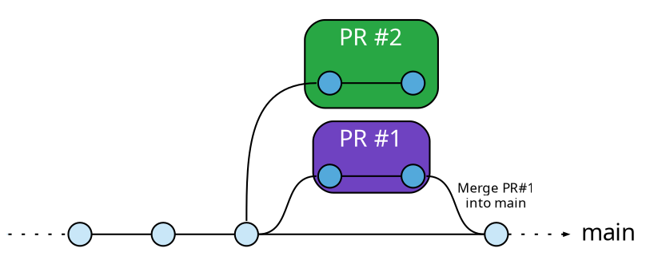
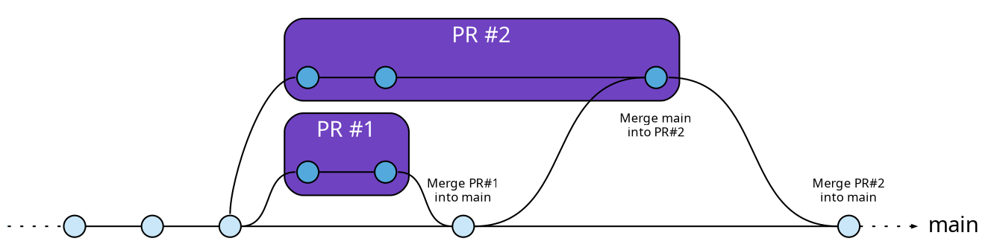

import Youtube from '../../components/Youtube.astro'

Development workflows can often be complex, with multiple developers
collaborating on a single codebase. This leads to multiple pull requests that
need to be merged in a specific order to ensure code stability and
compatibility. In this context, a merge queue is an essential tool.

A merge queue is a mechanism to manage and control the order of merging pull
requests into the main branch of your repository. It helps streamline the
development process, reduce merge conflicts, and maintain a healthy and stable
codebase.

In this guide, we will explore the concept of merge queues, their importance in
continuous integration and development workflows, and how Mergify's Merge Queue
can simplify and improve your development process.

## Why Do You Need a Merge Queue?

In modern software development, teams often work in parallel on multiple
features or bug fixes. This parallel work, although necessary for swift
development, poses a risk when changes are merged into the main branch.

Even with sophisticated CI/CD pipelines validating the correctness of each
change, a problem arises when multiple changes are ready to merge
simultaneously. While each change may be correct and compatible with the main
branch at the time it was last updated, merging one could introduce
incompatibilities with others that are also ready to merge.

This is the risk of merging pull requests that are not up-to-date with the main
branch: they may have been validated against an outdated version of the
codebase.

To mitigate this risk, engineers often find themselves in a race to update and
merge their pull requests before others do, leading to what we can call a
"merge war". This race not only distracts from productive development work but
also puts unnecessary pressure on engineers and creates an inefficient working
environment.

A merge queue addresses this issue by automatically ordering pull requests
ready to be merged, updating each one against the main branch, re-running
validations, and merging them only if they pass. This ensures that each change
is always up-to-date and validated against the real state of the main branch at
the time it's merged.

With a merge queue, there is no longer a need for engineers to participate in a
"merge war". The queue takes care of update and merge processes, allowing
engineers to focus on their core development tasks, while maintaining a steady,
efficient, and error-free integration flow.

<Youtube video="4PLTGJg82aw" title="Why you need a merge queue"/>

## The Three Pillars of an Effective Merge Workflow

While preventing broken main branches is crucial, a merge queue can optimize
your entire development workflow across three fundamental dimensions:

### 1. Reliability

**The Problem:** When multiple pull requests are ready to merge simultaneously,
each may pass CI individually, but merging one can create incompatibilities
with the others. A PR validated against an outdated main branch might break the
build when actually merged, even though it passed all checks.

**The Solution:** A merge queue ensures every change is validated against the
actual state of the main branch before merging. Each PR is updated with the
latest changes and re-tested, guaranteeing that only compatible, validated code
makes it into your main branch.

See [Understanding The Reliability Problem](#understanding-the-reliability-problem)
below for a detailed example of how this issue occurs and how merge queues
prevent it.

### 2. Velocity (Performance)

**The Problem:** Without a merge queue, you can merge PRs quickly (just click
merge on 10 PRs every morning), but when something breaks on the main branch,
the recovery process is slow and disruptive. You need to investigate which PR
caused the issue, revert it, and get the main branch healthy again, all while
blocking other developers from merging or deploying.

**The Solution:** A basic merge queue solves the reliability issue (see
[Reliability](#1-reliability) above) but introduces a new challenge: sequential
testing creates a bottleneck. To maintain high velocity while keeping the
reliability guarantee, a merge queue can use:

- **[Parallel speculative checks](/merge-queue/parallel-checks)**: Test
  multiple PRs simultaneously, predicting which will merge successfully and
  running their CI in parallel. This maintains the speed of "just click merge"
  without the risk of broken builds.

- **[Two-step CI workflows](/merge-queue/two-step)**: Run lightweight tests on
  every PR update, but save expensive comprehensive tests for when the PR
  actually enters the merge queue. This reduces wasted CI time on PRs that
  aren't ready to merge yet.

These strategies help high-velocity teams maintain rapid development pace while
ensuring compliance and code quality, giving you the speed without the recovery
pain.

### 3. Cost Optimization

**The Problem:** CI resources are expensive. Running full test suites on every
PR update, especially when PRs get repeatedly updated before merging, can
quickly consume significant compute resources and budget.

**The Solution:** A merge queue enables several cost-saving strategies:

- **[Batch merging](/merge-queue/batches)**: Combine multiple PRs into a single
    batch and test them together. Instead of running CI separately for 5 PRs, run
    it once for all 5 together, drastically reducing CI usage.

- **[Scope-aware batching](/merge-queue/scopes)**: Attach scopes to pull
    requests so Mergify groups related changes together. Shared test runs can be
    reused, making batching safer and more efficient—especially in monorepos.

- **[Two-step CI](/merge-queue/two-step)**: Move expensive tests (like E2E
    tests) to run only in the merge queue instead of on every PR update. Since
    PRs often get updated multiple times before merging—or may never merge at
    all—this can dramatically reduce CI costs while actually improving reliability
    by ensuring those critical tests run against the real merge state.

With these strategies, you can significantly reduce CI costs compared to running
all tests on every PR update, while simultaneously gaining better reliability
guarantees.

### Finding Your Balance

The key insight is that you can't optimize all three dimensions simultaneously.
As detailed in our [performance guide](/merge-queue/performance), this is
similar to the CAP theorem in distributed systems—you typically need to
prioritize two of the three:

- **Reliability + Velocity**: Maximum speed with guaranteed correctness (higher
  CI costs)

- **Reliability + Cost**: Minimal CI usage with guaranteed correctness (slower
  merges)

- **Velocity + Cost**: Fast, efficient merges with slightly relaxed guarantees
  (e.g., using batching)

Mergify's merge queue is highly configurable, allowing you to find the right
balance for your team's specific needs and constraints.

## Understanding The Reliability Problem

Let's consider a situation with a pull request ready to merge.

### Step 1: PR Passes CI

The developer made their changes on their feature branches. They've pushed
their changes, and their pull request has successfully passed all CI checks.
The CI pipeline has validated that their changes are compatible with the main
branch, and everything seems ready to merge.

### Step 2: Main Branch Gets a New Commit

Meanwhile, a second developer merges another change into the main branch. This
change doesn't conflict with the previous pull request at the code level, so
GitHub still marks them as safe to merge.

What's not seen here, is that the new commit on the main branch have caused a
change in the behavior of the code that makes the changes in our developer's PR
incompatible.

**This could be anything**: a new linter check has been added, a functional
test has been added and won't pass with this new code, a file or a component
has been renamed, etc.

### Step 3: Merging the PR Would Fail the CI

If the pull request gets merged now, it will create a failure in the main
branch because its changes are not compatible with the latest commit from the
main branch. The CI system couldn't know about this, because it validated the
developer's pull request against the previous main branch commit, and not the
latest.

Despite the CI check, the main branch now has a failure because the CI could
not anticipate the effect of the latest changes on the changes in the
developer's pull request.

**This scenario breaks the main branch.** This could prevent any deployment of
the code and will make any pull request created from this latest commit to not
pass the CI, blocking the entire development team until the situation is
manually addressed by an engineer.

This example demonstrates **the risk of merging pull requests that are not
up-to-date with the main branch.** It's a common scenario in active development
teams, and it's exactly the kind of problem a merge queue is designed to
prevent.

### Solving the Problem Using a Merge Queue

A merge queue provides an effective solution to the problem described above.
Let's walk through the same example but this time using a merge queue.

After the developer's pull request have passed their initial CI checks, they're
added to the merge queue rather than being merged immediately.

Here's where the magic happens. The merge queue will now update the pull
request to include changes from the latest commits from the main branch,
creating a new temporary merge commit.

It then runs CI checks on this new merge commit. This ensures that the changes
in the pull request are compatible with the current state of the main branch,
not its state when the PR was originally created.

In our example above, this would catch the incompatibility problem and
**prevents the pull request to get merged and to break the main branch.** The
PR is therefore not merged and is returned to the developer for revision.

By always testing against the latest state of the main branch, a merge queue
helps to prevent broken main branches, maintaining the integrity of your
codebase and ensuring that your team can always deliver working software.

When multiple pull requests are mergeable, they are scheduled to be merged
sequentially, and are updated on top of each other. The pull request branch
update is only done when the pull request is ready to be merged.

That means that when a first pull request has been merged, and the second one
is outdated like this:

A merge queue will make sure the pull request #2 is updated with the latest tip
of the base branch before being merged:

