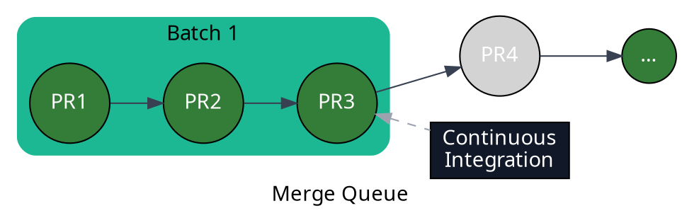

import { Image } from "astro:assets"
import batchesScreenshot from "../../images/merge-queue/batches/batches-dashboard.png"
import requiredPRbypassScreenshot from "../../images/merge-queue/batches/mergify-required-pull-request-bypass.png"

Mergify's batch merging feature is a powerful tool that enhances productivity
and efficiency in your development workflow. Instead of merging pull requests
one by one, which can be time-consuming, especially for larger projects, batch
merging allows you to combine and merge multiple pull requests at once.

The batch merging process works by setting a `batch_size` option on your merge
queue. This option determines the number of pull requests that Mergify will
check at the same time using your CI. If the CI validation passes, Mergify
merges all the pull requests in the batch and closes the draft pull request it
created to test.

If a failure occurs, Mergify identifies the problematic pull request(s)
automatically and removes them from the queue, allowing the rest of the queue
to be processed as usual (see [Handling Batch
Failures](#handling-batch-failure-or-timeout)).

This feature is especially useful for large-scale projects with many pull
requests to merge, as it can significantly reduce the time required to merge
them all.

## Understanding Batch Merging

Batch merging works by utilizing the `batch_size` option in your Mergify queue
configuration. This option tells Mergify how many pull requests it should try
to combine and validate at once. The `batch_size` can be adjusted according to
the needs of your project, with a higher number indicating a larger batch size.

For example, if you set `batch_size` to 3, Mergify will create a draft pull
request that includes the changes from the next three pull requests in the
queue. This draft pull request is then validated by your CI system. If all
checks pass, then the three pull requests included in the batch are deemed
ready to be merged.

```yaml
queue_rules:
  - name: default
    batch_size: 3
    ...
```



This batch merging process allows multiple pull requests to be validated and
merged more efficiently than if they were handled individually.

## Configuring Batch Merging

Configuring batch merging involves adjusting your Mergify configuration file to
set the `batch_size` option according to your project's needs.

1. Open your [Mergify configuration file](/configuration/file-format).

2. Under `queue_rules`, set the `batch_size` option to the number of pull
   requests you want to be tested together in a batch.

```yaml
queue_rules:
  - name: default
    batch_size: 3
    ...
```

In the above example, batches of up to 3 pull requests will be created and
tested together.

<Image src={batchesScreenshot} alt="Mergify merge queue with batches" />

You can configure the delay that Mergify will use to wait for the batch to be
filled up using the `batch_max_wait_time` option.

```yaml
queue_rules:
  - name: default
    batch_size: 5
    batch_max_wait_time: 5 min
    ...
```

With the configuration above, Mergify waits up to 5 minutes for 5 PR to enter
the queue before creating a batch. This allows you to pick the right trade-off
between latency and minimal CI usage.

## Merging the Draft PRs

By default, Mergify creates temporary branches and draft PRs for testing
batches. However, the original PRs are the ones merged, not these temporary
branches. This ensures the integrity and traceability of the original pull
requests.

However, there might be scenarios where you want to merge the temporary
branches instead. One advantage of this is maintaining the same SHA1, which
might be important for some workflows and for traceability.

Also, if you are deploying after a merge, this can also make sure that you
trigger only a single deployment once a batch of pull request is fully tested
and passes the CI.

Mergify provides a setting called `queue_branch_merge_method` for this purpose.
By setting `queue_branch_merge_method` to `fast-forward`, Mergify will merge
the temporary branches instead of the original PRs. The default setting is
`none`, which means the temporary branches are not merged.

Here is an example configuration:

```yaml
queue_rules:
  - name: default
    batch_size: 10
    queue_branch_merge_method: fast-forward
    merge_method: merge
```

:::note

  Please note that this setting only works if `merge_method` is set to `merge`.
  This is necessary so GitHub can mark the original PR as "merged" once the
  temporary branch is merged. This configuration makes sure that the original
  SHA1 from the PRs are included in the temporary branch and thus are detected
  as merged. Importantly, the final merged result is the exact SHA1 of what has
  been tested by CI, ensuring consistency and traceability.

:::

:::caution

  If GitHub branch protections are enabled, fast-forward requires some
  additional configuration in branch protection settings, you also need to
  allow Mergify to "bypass the required pull requests" to merge.

  This is mandatory since Mergify pushes the temporary branch to the base
  branch without going through a pull request in order to keep the same SHA1.

  <Image src={requiredPRbypassScreenshot} alt="Mergify bypass required pull requests" />

:::

## Handling Batch Failure or Timeout

When a batch fails, or when the checks time out with the option
`checks_timeout` on, Mergify does not remove all its pull requests from the
queue. Instead, it takes additional steps to identify the problematic pull
request and remove it from the queue.

This is how it works:

1. **Splitting the batch**: If a batch fails, all subsequent batches are deemed
   to fail as well, are canceled and put back into the queue. The system splits
   the failed batch to isolate the problematic pull request. The size of these
   new batches is determined by the `max_parallel_checks` parameter. By
   default, the batch is split into two; however, if `max_parallel_checks` is
   set to a value greater than 1, it dictates the number of batches the failed
   batch should be divided into.

2. **Testing the new batches**: After splitting, the first new batch is
   immediately retested, while others are queued. If `max_parallel_checks` is
   greater than 1, the system will also test subsequent batch split at the same
   time. This continues until the split is done.

3. **Handling the result**: If the first batch split succeeds, it is merged and
   the next split is scheduled for testing. If the batch fails, Mergify splits
   this batch, going back to step 1.

4. **Pin-pointing the failed batch**: If a batch contains only one pull request
   and still fails, it is deemed to be the culprit and is removed from the
   queue.

Note that this system is completely automatic and there is no need to
intervene. The number of maximum splits can be controlled by
[`batch_max_failure_resolution_attempts`](/configuration/file-format#queue-rules).

:::note

Mergify optimizes batching while always respecting queue priorities.
When a batch is being assembled and its maximum size is not yet reached, 
Mergify checks whether another pull request with the same queue rule can be 
added—even if it appears later in the queue.
If such a match is found, it is included in the batch to save an entire CI cycle and
speed up merges, while still honoring all rules and priority ordering.

:::

### Batch Failure Scenario Example

Let's assume that we have a batch of 6 pull requests: `[PR1 + PR2 + PR3 + PR4 +
PR5 + PR6]`. During the initial testing, Mergify first tests the batch with all
6 pull requests together.

As the batch fails, this could be due to any of the PRs or a specific
combination of them. Mergify learned that the combination
`[PR1 + PR2 + PR3 + PR4 + PR5 + PR6]` does not work; it now needs to test parts
of this combination.

With `max_parallel_checks` set to 3, the system will aim to split the batch
into 3 parts:

- First part: `[PR1 + PR2]`
- Second part: `[PR1 + PR2 + PR3 + PR4]`
- Third part: `[PR1 + PR2 + PR3 + PR4 + PR5]`

:::tip[Tips]
  Mergify already tested `[PR1 + PR2 + PR3 + PR4 + PR5 + PR6]` in the
  original batch and knows it does not work. No need to test it again!
:::

The system will immediately retest the different parts since the number of
splits matches the number of parallel checks allowed.

If the first part `[PR1 + PR2]` passes, the system will merge it.

If the first part `[PR1 + PR2]` fails, the system will split it again and test
each PR individually, applying the algorithm again.

If there's a consecutive failure in the subsequent parts, the system will
continue to split and isolate the problematic PR(s) and retest until the split
contains a single pull request.

## Important Considerations

While using batch merging and parallel checks together can significantly speed
up your merge queue processing, it's crucial to consider the following points
for an optimal setup:

### Branch Protection Settings

Since pull requests are tested within temporary ones, the branch protection
setting `Require branches to be up to date before merging` needs to be
disabled. If your team requires a linear history, you can set the queue option
`merge_method: rebase`.

This does not mean that Mergify will test outdated PRs, but it will merge the
original pull requests once its parallel checks are finished. The original PR
won't be up-to-date according to GitHub, which means using this setting would
block the merge.

### Queued PR Changes

Remember that changes to PRs or the queue can disrupt the batch process. If a
PR is updated or changed in a way that it no longer meets the `queue_rules`, it
will be removed from the queue, and the order of checks will be updated. In
such cases, the process resets, and the remaining PRs are rechecked in their
new order.
