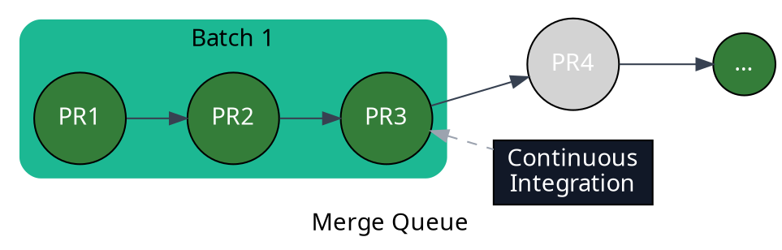
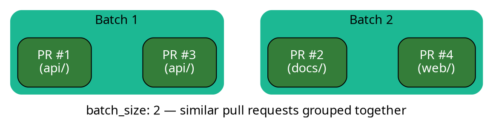

import { Image } from "astro:assets"
import Youtube from '../../../components/Youtube.astro'
import batchesScreenshot from "../../images/merge-queue/batches/batches-dashboard.png"
import requiredPRbypassScreenshot from "../../images/merge-queue/batches/mergify-required-pull-request-bypass.png"

Mergify's batch merging feature is a powerful tool that enhances productivity
and efficiency in your development workflow. Instead of merging pull requests
one by one, which can be time-consuming, especially for larger projects, batch
merging allows you to combine and merge multiple pull requests at once.

:::tip
  Learn the concepts behind batching and its trade-offs at the
  [Merge Queue Academy](https://merge-queue.academy/features/batching/).
:::

The batch merging process works by setting a `batch_size` option on your merge
queue. This option determines the number of pull requests that Mergify will
check at the same time using your CI. If the CI validation passes, Mergify
merges all the pull requests in the batch and closes the batch pull request it
created to test.

If a failure occurs, Mergify identifies the problematic pull request(s)
automatically and removes them from the queue, allowing the rest of the queue
to be processed as usual (see [Handling Batch
Failures](#handling-batch-failure-or-timeout)).

This feature is especially useful for large-scale projects with many pull
requests to merge, as it can significantly reduce the time required to merge
them all.

<Youtube video="2mVymDFMaMk" title="Using batch and two-step CI"/>

## Understanding Batch Merging

Batch merging works by utilizing the `batch_size` option in your Mergify queue
configuration. This option tells Mergify how many pull requests it should try
to combine and validate at once. The `batch_size` can be adjusted according to
the needs of your project, with a higher number indicating a larger batch size.

For example, if you set `batch_size` to 3, Mergify will create a batch pull
request that includes the changes from the next three pull requests in the
queue. This batch pull request is then validated by your CI system. If all
checks pass, then the three pull requests included in the batch are deemed
ready to be merged.

```yaml
queue_rules:
  - name: default
    batch_size: 3
    ...
```


```dot class="graph"
strict digraph {
    fontname="sans-serif";
    rankdir="LR";
    label="Merge Queue"

    node [style=filled, shape=circle, fontcolor="white", fontname="sans-serif"];
    edge [color="#374151", arrowhead=none, fontname="sans-serif", arrowhead=normal];

    subgraph cluster_batch_0 {
        style="rounded,filled";
        color="#1CB893";
        fillcolor="#1CB893";
        fontcolor="#000000";
        node [style=filled, color="black", fillcolor="#347D39", fontcolor="white"];
        PR1 -> PR2;
        PR2 -> PR3;
        label = "Batch 1";
    }

    PR3 -> PR4;
    PR4 -> PR5;
    PR5 [label="…", fillcolor="#347D39"];

    CI [label="Continuous\nIntegration", fixedsize=false, style="filled", fillcolor="#111827", fontcolor=white, shape=rectangle]
    edge [arrowhead=none, style=dashed, arrowtail=normal, color="#9CA3AF", dir=both, fontcolor="#9CA3AF", fontsize="6pt"];
    PR3 -> CI;
}
```

This batch merging process allows multiple pull requests to be validated and
merged more efficiently than if they were handled individually.

## Configuring Batch Merging

Configuring batch merging involves adjusting your Mergify configuration file to
set the `batch_size` option according to your project's needs.

1. Open your [Mergify configuration file](/configuration/file-format).

2. Under `queue_rules`, set the `batch_size` option to the number of pull
   requests you want to be tested together in a batch.

```yaml
queue_rules:
  - name: default
    batch_size: 3
    ...
```

In the above example, batches of up to 3 pull requests will be created and
tested together.

<Image src={batchesScreenshot} alt="Mergify merge queue with batches" />

You can configure the delay that Mergify will use to wait for the batch to be
filled up using the `batch_max_wait_time` option.

```yaml
queue_rules:
  - name: default
    batch_size: 5
    batch_max_wait_time: 5 min
    ...
```

With the configuration above, Mergify waits up to 5 minutes for 5 PR to enter
the queue before creating a batch. This allows you to pick the right trade-off
between latency and minimal CI usage.

## How Pull Requests Are Grouped Into a Batch

When `batch_size` is greater than 1, Mergify has to decide *which* pull requests
go into a batch together. It does **not** simply take the next few pull requests
in the queue. Instead, it groups pull requests that touch **similar** parts of
your codebase, so each batch is a cohesive set of related changes. This makes
batch failures cheaper to resolve: when a batch fails and has to be
[split](#handling-batch-failure-or-timeout), related changes stay together and
unrelated pull requests aren't dragged into someone else's failure.

This is the default merge queue behavior (serial mode). Parallel mode groups
pull requests strictly by scope instead. See [Queue
Modes](/merge-queue/queue-modes#parallel-mode).

Grouping applies these rules in order of precedence: it never overrides
[priority](/merge-queue/priority) or queue order, it always keeps a
[stack](/merge-queue/stacks) together, and only then does similarity fill
whatever batch slots remain. The sections below follow that order.

### Priority comes first

Grouping never overrides [priority](/merge-queue/priority) or queue order.
Mergify seeds each batch with the pull request that is next to merge: the
highest priority, and the oldest among equal priorities. Similarity only ever
breaks ties **between pull requests of equal priority**: a lower-priority pull
request is never pulled ahead of a higher-priority one just because it is
similar. Higher-priority pull requests always fill the batch first; lower
priorities are only considered once the batch still has room.

### Stacks stay together

Stacks are the next firm rule, applied before similarity is considered. When a
pull request depends on earlier ones still in the queue (a
[stack](/merge-queue/stacks)), Mergify keeps the whole stack in one batch:
whenever a pull request joins a batch, its queued predecessors join with it,
whether or not they share its scopes or changed directories.

This is why stack relationships take precedence over scope and directory
similarity. A predecessor joins the batch because the dependency requires it,
not because it ranked highly. The only limit is `batch_size`: if the stack
doesn't fit, the dependent pull request waits for a later batch rather than
being tested without the changes it builds on.

### Filling the batch by similarity

Priority and stacks decide what a batch must contain. Similarity decides the
rest: which of the remaining equal-priority pull requests fill the slots that
are still free (up to `batch_size`). Mergify adds them one at a time, ranking
every waiting candidate by three criteria applied **in order**, each one only
breaking the ties the previous one leaves open:

1. **[Scopes](/merge-queue/scopes).** The pull requests that share the most
   scopes with the batch are the strongest match and are grouped together.

2. **Changed directories.** When scopes don't separate two candidates, Mergify
   compares the **directories each pull request changes** and prefers the one
   touching the same areas of the repository. On very large monorepos it
   automatically compares broader areas (parent directories) rather than every
   individual folder, so grouping stays effective whatever the repository size.

3. **Queue time.** If two pull requests are still tied, the one that has been
   waiting longest joins the batch first, keeping first-in, first-out order.

Scopes always take precedence over directories; the changed directories only
decide the grouping when scopes leave it open. In practice this depends on your
configuration: if you have configured [scopes](/merge-queue/scopes), pull
requests are grouped by scope and the directory signal stays out of the way. If
you have not, every pull request reports no scope, so that signal is a tie for
all of them and grouping falls back entirely to the directories they change.

Because of this, a pull request further down the queue may join an earlier batch
when it is similar to what is already there, while a closer but unrelated pull
request waits for the next batch:


```dot class="graph"
strict digraph {
  fontname="sans-serif";
  rankdir="LR";
  label="batch_size: 2 — similar pull requests grouped together";
  nodesep=0.5;
  ranksep=0.8;

  node [shape=box, style="rounded,filled", fontcolor="white", fontname="sans-serif", margin="0.3,0.18"];
  edge [style=invis];

  subgraph cluster_batch1 {
    style="rounded,filled";
    color="#1CB893";
    fillcolor="#1CB893";
    fontcolor="#000000";
    label="Batch 1";
    PR1 [label="PR #1\n(api/)", fillcolor="#347D39"];
    PR3 [label="PR #3\n(api/)", fillcolor="#347D39"];
  }

  subgraph cluster_batch2 {
    style="rounded,filled";
    color="#1CB893";
    fillcolor="#1CB893";
    fontcolor="#000000";
    label="Batch 2";
    PR2 [label="PR #2\n(docs/)", fillcolor="#347D39"];
    PR4 [label="PR #4\n(web/)", fillcolor="#347D39"];
  }

  PR1 -> PR3 -> PR2 -> PR4;
}
```

Here the queue order is PR #1, #2, #3, #4. PR #3 changes the same area as PR #1
(`api/`), so it joins PR #1 in the first batch even though PR #2 was queued
earlier. PR #2 and PR #4, which touch unrelated areas, fall into the next batch.

:::note
  Grouping only considers the pull requests waiting in the queue when a batch is
  assembled. Use [`batch_max_wait_time`](#configuring-batch-merging) to let
  Mergify wait for more pull requests to arrive before assembling a batch, which
  gives the grouping more candidates to work with.
:::

## Merging the Batch PRs

By default, Mergify creates temporary branches and batch PRs for testing
batches. However, the original PRs are the ones merged, not these temporary
branches. This ensures the integrity and traceability of the original pull
requests.

However, there might be scenarios where you want to merge the temporary
branches instead. One advantage of this is maintaining the same SHA1, which
might be important for some workflows and for traceability.

Also, if you are deploying after a merge, this can also make sure that you
trigger only a single deployment once a batch of pull request is fully tested
and passes the CI.

There are two ways to merge the batch PR directly:

### Fast-Forward

Set `merge_method: fast-forward` on your queue rule. When
batching is enabled, Mergify creates the batch PR as usual, runs CI on it,
and then fast-forwards the base branch to the batch PR's head commit instead
of merging the original PRs individually.

```yaml
queue_rules:
  - name: default
    batch_size: 10
    merge_method: fast-forward
```

See [Merge Strategies: Fast-Forward](/merge-queue/merge-strategies#fast-forward)
for a detailed explanation of how fast-forward works in both inplace and
batch-PR modes.

:::caution
  If GitHub branch protections are enabled, fast-forward requires some
  additional configuration in branch protection settings, you also need to
  allow Mergify to "bypass the required pull requests" to merge.

  This is mandatory since Mergify pushes the temporary branch to the base
  branch without going through a pull request in order to keep the same SHA1.

  <Image src={requiredPRbypassScreenshot} alt="Mergify bypass required pull requests" />
:::

### Merge Batch

Set `merge_method: merge-batch` on your queue rule. This merge method requires
`batch_size` to be greater than 1. Mergify creates the batch PR as usual, runs
CI on it, and then merges the batch PR into the base branch using the GitHub
Pull Request merge API with a merge commit. The merge commit message lists all
the pull requests included in the batch.

```yaml
queue_rules:
  - name: default
    batch_size: 10
    merge_method: merge-batch
```

Unlike `fast-forward`, `merge-batch` uses the standard GitHub merge API, so it
works with branch protection settings that require pull request merges — no
bypass configuration is needed.

See [Merge Strategies: Merge Batch](/merge-queue/merge-strategies#merge-batch)
for more details.

## Handling Batch Failure or Timeout

When a batch fails, or when the checks time out with the option
`checks_timeout` on, Mergify does not remove all its pull requests from the
queue. Instead, it takes additional steps to identify the problematic pull
request and remove it from the queue.

This is how it works:

1. **Splitting the batch**: If a batch fails, all subsequent batches are deemed
   to fail as well, are canceled and put back into the queue. The system splits
   the failed batch to isolate the problematic pull request. The size of these
   new batches is determined by the `max_parallel_checks` parameter. By
   default, the batch is split into two; however, if `max_parallel_checks` is
   set to a value greater than 1, it dictates the number of batches the failed
   batch should be divided into.

2. **Testing the new batches**: After splitting, the first new batch is
   immediately retested, while others are queued. If `max_parallel_checks` is
   greater than 1, the system will also test subsequent batch split at the same
   time. This continues until the split is done.

3. **Handling the result**: If the first batch split succeeds, it is merged and
   the next split is scheduled for testing. If the batch fails, Mergify splits
   this batch, going back to step 1.

4. **Pin-pointing the failed batch**: If a batch contains only one pull request
   and still fails, it is deemed to be the culprit and is removed from the
   queue.

Note that this system is completely automatic and there is no need to
intervene. The number of maximum splits can be controlled by
[`batch_max_failure_resolution_attempts`](/configuration/file-format#queue-rules).

### Batch Failure Scenario Example

Let's assume that we have a batch of 6 pull requests: `[PR1 + PR2 + PR3 + PR4 +
PR5 + PR6]`. During the initial testing, Mergify first tests the batch with all
6 pull requests together.

As the batch fails, this could be due to any of the PRs or a specific
combination of them. Mergify learned that the combination
`[PR1 + PR2 + PR3 + PR4 + PR5 + PR6]` does not work; it now needs to test parts
of this combination.

With `max_parallel_checks` set to 3, the system will aim to split the batch
into 3 parts:

- First part: `[PR1 + PR2]`
- Second part: `[PR1 + PR2 + PR3 + PR4]`
- Third part: `[PR1 + PR2 + PR3 + PR4 + PR5]`

:::tip[Tips]
  Mergify already tested `[PR1 + PR2 + PR3 + PR4 + PR5 + PR6]` in the
  original batch and knows it does not work. No need to test it again!
:::

The system will immediately retest the different parts since the number of
splits matches the number of parallel checks allowed.

If the first part `[PR1 + PR2]` passes, the system will merge it.

If the first part `[PR1 + PR2]` fails, the system will split it again and test
each PR individually, applying the algorithm again.

If there's a consecutive failure in the subsequent parts, the system will
continue to split and isolate the problematic PR(s) and retest until the split
contains a single pull request.

## Important Considerations

While using batch merging and parallel checks together can significantly speed
up your merge queue processing, it's crucial to consider the following points
for an optimal setup:

### Branch Protection Settings

Batches require the branch protection setting *Require branches to be up to
date before merging* to be disabled. If your team requires a linear history,
you can set the queue option `merge_method: rebase`.

For details on why and how to resolve this, see [GitHub Rulesets
Compatibility: Require Branches to Be Up to
Date](/merge-queue/github-rulesets#require-branches-to-be-up-to-date).

### Queued PR Changes

Remember that changes to PRs or the queue can disrupt the batch process. If a
PR is updated or changed in a way that it no longer meets the `queue_rules`, it
will be removed from the queue, and the order of checks will be updated. In
such cases, the process resets, and the remaining PRs are rechecked in their
new order.
