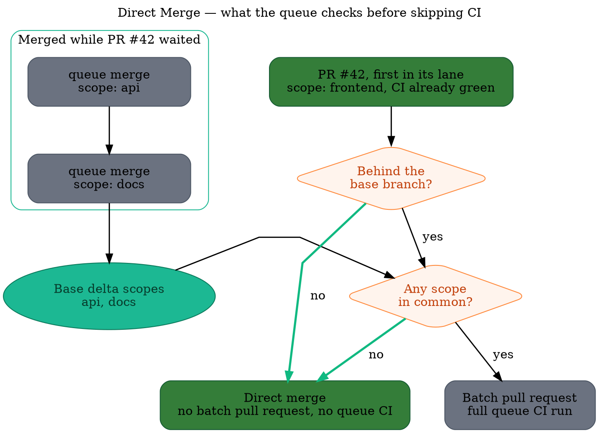

A merge queue exists to test a pull request against the state its base branch will actually have at
merge time. When that state has not meaningfully changed for this particular pull request, testing
it again proves nothing: the green CI already on the pull request covers the merge.

**Direct Merge** is the optimization that recognizes those cases. When a pull request reaches the
front of its lane on its own, Mergify asks what the base branch has done underneath it since that
pull request was last updated. Two answers let it merge straight away, with no batch pull request
and no merge queue CI run:

- **Already up to date.** The pull request already contains the tip of the base branch, so the code
  that would land is the code its own CI already ran on.

- **Behind only in other scopes.** The pull request is behind, but only by merges the queue landed
  in [scopes](/merge-queue/scopes) it does not touch.

Neither needs to be turned on. The first case applies to every repository, with or without scopes,
in all three [queue modes](/merge-queue/queue-modes). The second needs scopes, and any repository
using them gets it on the pull requests that qualify.

Here is the whole decision. PR #42 touches the `frontend` scope; while it waited, the queue landed
two merges that touched `api` and `docs`. Nothing PR #42 depends on has changed, so its own green CI
still describes the merge and the queue skips straight to merging it. Had the queue landed nothing
at all in the meantime, the first question alone would have been enough.

## Why this is safe

### The already-up-to-date case

There is nothing to prove. The tip of the base branch is already an ancestor of the pull request's
head, so merging changes what the base branch points at without changing what it contains: the code
that lands is the code the pull request's own CI ran on. A batch pull request would test the same
change against the same base a second time.

### The scope case

Two pull requests only need to be tested together when they can affect each other. Scopes are the
declaration of what a pull request can affect, so two pull requests with disjoint scopes cannot
interact by construction. A frontend change does not become wrong because a database migration
landed while it was queued.

Direct Merge applies that reasoning to a single pull request and the base branch beneath it:

1. Read the current tip of the base branch.

2. Walk back through the merges the merge queue itself recorded, until reaching a commit the pull
   request already contains.

3. Union the scopes of every merge in between.

4. If that union does not intersect the pull request's own scopes, merge it as is.

The walk only trusts merges the merge queue performed and recorded. It stops, and Direct Merge
declines, as soon as it cannot attribute a missing base commit to one of those recorded merges,
whether that is an external merge, a direct push to the base branch, or any commit it has no
record of.

## When it applies

Direct Merge is deliberately conservative. Whenever it cannot prove the base changes are unrelated,
it declines rather than guesses, and the pull request takes the normal queue path, with a batch pull
request and a full CI run.

### In both cases

- **The pull request is alone at the front of its lane.** Nothing the queue has yet to merge sits
  between it and the base branch.

- **The queue does not use [two-step CI](/merge-queue/two-step).** Two-step CI defers the heavy
  suite to the queue on purpose, so the pull request's own CI is not the full signal.

- **`autosquash` is off.** Rewriting the commits changes what was tested.

- **The merge method is not [`merge-batch`](/merge-queue/merge-strategies#merge-batch).** It merges
  the batch pull request itself, so there has to be one.

### Only for the already-up-to-date case

Nothing more. This case needs no scopes and no scope configuration. It is also the one place a
[`fast-forward`](/merge-queue/merge-strategies#fast-forward) queue qualifies: fast-forward moves the
base branch onto the pull request's head, and that requires the head to contain the base tip
already, which is exactly the situation here. Fast-forward is not supported in the parallel or
isolated [queue modes](/merge-queue/queue-modes) for reasons of its own, so this only ever arises in
a serial queue.

### Only for the scope case

- **The pull request has scopes.** Without them it lands in the catch-all lane, where Mergify treats
  it as able to affect anything.

- **It is not a barrier.** A pull request marked
  [`all_scopes`](/merge-queue/scopes#declaring-a-pull-request-impacts-every-scope) declares that it
  impacts every scope, including ones not yet defined.

- **The base delta is fully recorded.** Every commit it is missing must come from a merge the queue
  recorded, so that the scopes of those commits are known.

- **The merge method is not [`fast-forward`](/merge-queue/merge-strategies#fast-forward).** A pull
  request that is behind cannot be fast-forward-merged, because moving the base branch onto its
  head would drop the commits that head does not contain. Rebasing it first is what the normal
  queue path does.

## What it changes for you

The two cases pay off in different repositories.

A pull request that is **already up to date** merges the moment it reaches the front, in any
repository. That is the everyday case on a queue that is not permanently busy, and on any pull
request rebased or updated shortly before it was queued: nothing landed underneath it, so there is
nothing new to test.

The **scope** case scales with your monorepo. The larger and more independent its areas are, the
more often a busy queue turns out to have landed nothing relevant. A pull request that would have
waited for a full validation cycle merges in seconds, and the CI run it would have consumed is never
scheduled.

Either way it compounds with the rest of the queue rather than replacing it:

- [Parallel mode](/merge-queue/queue-modes#parallel-mode) already stops unrelated pull requests from
  queueing behind each other. Direct Merge removes the remaining CI run for the ones that turn out
  to need no validation at all.

- [Batches](/merge-queue/batches) still handle the pull requests that do share scopes, with
  bisection when one of them fails.

:::note
  Direct Merge only ever skips the *queue's* CI run. The queue rules still apply in full: a pull
  request that does not satisfy them is not merged, directly or otherwise.
:::

## Getting the most out of it

The already-up-to-date case asks nothing of you. The scope case pays off in proportion to how well
your scopes describe your repository, so the work that improves it is the work that makes scopes
accurate:

- **Derive scopes from your build system** where you can. A build graph knows exactly what a change
  affects, so the scope sets come out both correct and narrow. See
  [Bazel](/merge-queue/scopes/bazel), [Nx](/merge-queue/scopes/nx),
  [Turborepo](/merge-queue/scopes/turborepo) and [other build tools](/merge-queue/scopes/others).

- **Keep scopes narrow.** A single `backend` scope covering half the repository intersects almost
  everything. Splitting it into the services it really contains makes far more pull requests
  provably independent.

- **Use barriers sparingly.** `scopes.barrier_files` is the right tool for a toolchain bump, but
  every barrier is a pull request that can never be direct-merged in the scope case, and it blocks
  the ones queued around it too.
