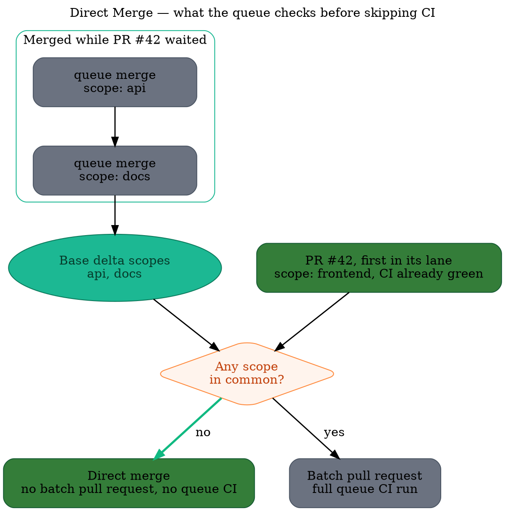

A merge queue exists to test a pull request against the state its base branch will actually have at
merge time. When that state has not meaningfully changed for this particular pull request, testing
it again proves nothing: the green CI already on the pull request covers the merge.

**Direct Merge** is the optimization that recognizes those cases. When a pull request reaches the
front of its lane and the only base commits it is missing come from merges in
[scopes](/merge-queue/scopes) it does not touch, Mergify merges it immediately, without creating a
batch pull request and without running merge queue CI.

Nothing needs to be configured. Any repository using scopes gets it on the pull requests that
qualify, in [serial and parallel modes](/merge-queue/queue-modes) alike.

Here is the whole decision. PR #42 touches the `frontend` scope; while it waited, the queue landed
two merges that touched `api` and `docs`. Nothing PR #42 depends on has changed, so its own green CI
still describes the merge and the queue skips straight to merging it.

## Why this is safe

Two pull requests only need to be tested together when they can affect each other. Scopes are the
declaration of what a pull request can affect, so two pull requests with disjoint scopes cannot
interact by construction. A frontend change does not become wrong because a database migration
landed while it was queued.

Direct Merge applies that reasoning to a single pull request and the base branch beneath it:

1. Read the current tip of the base branch.

2. Walk back through the merges the merge queue itself recorded, until reaching a commit the pull
   request already contains.

3. Union the scopes of every merge in between.

4. If that union does not intersect the pull request's own scopes, merge it as is.

The walk only trusts merges the merge queue performed and recorded. It stops, and Direct Merge
declines, as soon as it cannot attribute a missing base commit to one of those recorded merges,
whether that is an external merge, a direct push to the base branch, or any commit it has no
record of.

## When it applies

Every one of these has to be true. If any is not, the pull request takes the normal queue path,
with a batch pull request and a full CI run.

- **The pull request has scopes.** Without them it lands in the catch-all lane, where Mergify treats
  it as able to affect anything.

- **It is not a barrier.** A pull request marked
  [`all_scopes`](/merge-queue/scopes#declaring-a-pull-request-impacts-every-scope) declares that it
  impacts every scope, including ones not yet defined.

- **It is alone at the front of its lane.** The base delta is only provable when no other queued
  pull request sits between it and the base branch.

- **The base delta is fully recorded.** Every commit it is missing must come from a merge the queue
  recorded, so that the scopes of those commits are known.

- **The queue does not use [two-step CI](/merge-queue/two-step).** Two-step CI defers the heavy
  suite to the queue on purpose, so the pull request's own CI is not the full signal.

- **`autosquash` is off.** Rewriting the commits changes what was tested.

- **The merge method is neither `fast-forward` nor `merge-batch`.** Both need the head to be rebased
  first, or a real batch pull request to exist.

Direct Merge is deliberately conservative. Whenever it cannot prove the base changes are unrelated,
it declines rather than guesses, and the pull request goes through CI as usual.

## What it changes for you

The larger and more independent your monorepo's areas are, the more often it fires. A pull request
that would have waited for a full validation cycle merges in seconds, and the CI run it would have
consumed is never scheduled.

It compounds with the rest of the queue rather than replacing it:

- [Parallel mode](/merge-queue/queue-modes#parallel-mode) already stops unrelated pull requests from
  queueing behind each other. Direct Merge removes the remaining CI run for the ones that turn out
  to need no validation at all.

- [Batches](/merge-queue/batches) still handle the pull requests that do share scopes, with
  bisection when one of them fails.

:::note
  Direct Merge only ever skips the *queue's* CI run. The queue rules still apply in full: a pull
  request that does not satisfy them is not merged, directly or otherwise.
:::

## Getting the most out of it

Direct Merge pays off in proportion to how well your scopes describe your repository, so the work
that improves it is the work that makes scopes accurate:

- **Derive scopes from your build system** where you can. A build graph knows exactly what a change
  affects, so the scope sets come out both correct and narrow. See
  [Bazel](/merge-queue/scopes/bazel), [Nx](/merge-queue/scopes/nx),
  [Turborepo](/merge-queue/scopes/turborepo) and [other build tools](/merge-queue/scopes/others).

- **Keep scopes narrow.** A single `backend` scope covering half the repository intersects almost
  everything. Splitting it into the services it really contains makes far more pull requests
  provably independent.

- **Use barriers sparingly.** `scopes.barrier_files` is the right tool for a toolchain bump, but
  every barrier is a pull request that can never be direct-merged, and it blocks the ones queued
  around it too.
