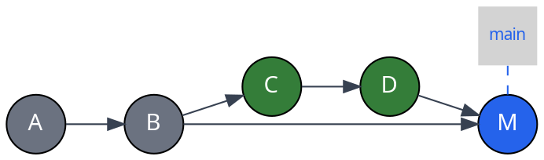
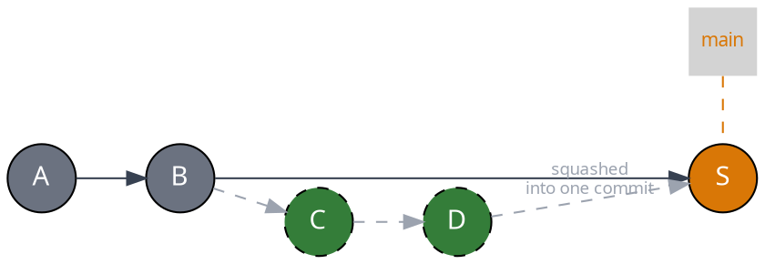
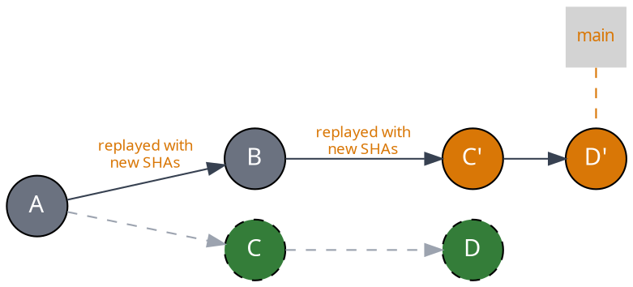
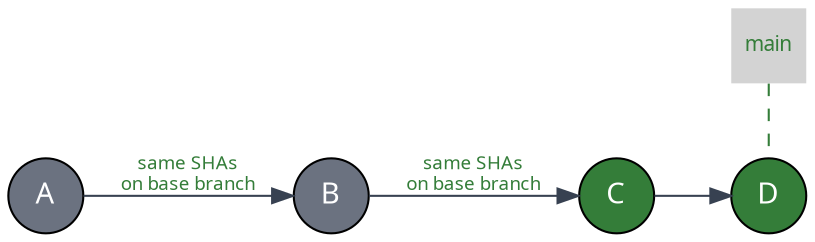

import { Image } from "astro:assets"
import requiredPRbypassScreenshot from "../../images/merge-queue/batches/mergify-required-pull-request-bypass.png"

The `merge_method` option in your queue rules controls how Mergify merges pull
requests into your base branch. Each method produces a different git history
shape, with trade-offs between linearity, SHA preservation, and throughput.

## Merge Methods at a Glance

| Method | History | Commits on base branch | SHAs preserved | Queue parallelism |
|---|---|---|---|---|
| `merge` | Non-linear | Original commits + merge commit | Yes | Full |
| `squash` | Linear | 1 new commit per PR | No | Full |
| `rebase` | Linear | Recreated copies of each commit | No | Full |
| `fast-forward` | Linear | Original commits moved to base | Yes | Serial only |

## Merge (Default)

```yaml
queue_rules:
  - name: default
    merge_method: merge
```

Creates a merge commit joining the PR branch into the base branch. This is the
default GitHub merge behavior.



- **History:** non-linear — the PR branch and base branch are visible as
  separate lines in `git log --graph`

- **Merge commits:** yes — each PR produces a merge commit on the base branch

- **SHAs preserved:** yes — original PR commits keep their SHAs

- **Use case:** most teams; simplest setup with no constraints on parallelism
  or batching

## Squash

```yaml
queue_rules:
  - name: default
    merge_method: squash
```

Squashes all PR commits into a single commit on the base branch.



- **History:** linear — one commit per PR on the base branch
- **Merge commits:** no
- **SHAs preserved:** no — a new commit is created
- **Use case:** teams that want a clean `git log` where one commit = one PR

## Rebase

```yaml
queue_rules:
  - name: default
    merge_method: rebase
```

Replays each PR commit on top of the base branch, creating new commits with new
SHAs.



- **History:** linear — no merge commits, individual commits are preserved

- **Merge commits:** no

- **SHAs preserved:** no — commits are recreated with new SHAs, so the PR
  branch ref won't match the base branch

- **Use case:** teams that want linear history with individual commits visible,
  but don't need SHA preservation

## Fast-Forward

```yaml
merge_queue:
  max_parallel_checks: 1

queue_rules:
  - name: default
    merge_method: fast-forward
    batch_size: 1
```

Moves the base branch ref directly to the PR's head commit using the Git API.
No merge commit is created and no commits are recreated — the original SHAs
from the PR branch end up on the base branch.



- **History:** linear — commits sit directly on the base branch

- **Merge commits:** no

- **SHAs preserved:** yes — the exact same commit SHAs from the PR appear on
  the base branch

- **Use case:** teams and OSS projects that care about commit identity and want
  `git log --oneline` to be perfectly clean

### Requirements and Constraints

Fast-forward merging has specific requirements:

- **`batch_size` must be `1`** — batching is not supported because fast-forward
  can only advance the ref to a single PR's head

- **Global `merge_queue.max_parallel_checks` must be set to `1`** — speculative
  checks (draft PRs) are not supported

- **Two-step CI is not supported** — for the same reason as above

- **`update_method` defaults to `rebase`** — PRs must be rebased on top of the
  base branch before merging so the fast-forward is possible. Note that if a
  rebase update occurs, the commit SHAs on the PR will change — what
  fast-forward preserves are the SHAs of the PR branch at merge time

:::caution
  Fast-forward requires Mergify to push directly to the base branch without
  going through a pull request merge. If GitHub branch protections are enabled,
  you must allow Mergify to **bypass the required pull requests** setting.

  <Image src={requiredPRbypassScreenshot} alt="Mergify bypass required pull requests" />
:::

### Complete Example

A typical fast-forward configuration for a repository that wants a strictly
linear history with preserved commit SHAs:

```yaml
merge_queue:
  max_parallel_checks: 1

queue_rules:
  - name: default
    merge_method: fast-forward
    batch_size: 1
    merge_conditions:
      - check-success = ci
```

## Combining Merge and Update Methods

The `update_method` option controls how Mergify updates PR branches when they
fall behind the base branch. Combining `merge_method` with `update_method`
gives you additional control over your history shape.

### Semi-Linear History (Rebase + Merge Commit)

```yaml
queue_rules:
  - name: default
    merge_method: merge
    update_method: rebase
```

PRs are rebased on top of the base branch before being merged with a merge
commit. This produces a history where individual commits are linear, but each
PR is wrapped in a merge commit that marks the PR boundary.

- **Use case:** teams that want linear commits but also want merge commits as
  PR boundary markers in `git log --graph`

### Linear History via Rebase Update

```yaml
queue_rules:
  - name: default
    merge_method: rebase
    update_method: rebase
```

PRs are rebased to stay current, then rebased again at merge time. This
produces a fully linear history with no merge commits, though SHAs will differ
from the original PR branch.

## Choosing the Right Strategy

| I want... | `merge` | `squash` | `rebase` | `fast-forward` |
|---|:---:|:---:|:---:|:---:|
| Linear history | | ✔ | ✔ | ✔ |
| Preserved commit SHAs | ✔ | | | ✔ |
| One commit per PR | | ✔ | | |
| Individual PR commits visible | ✔ | | ✔ | ✔ |
| See PR boundaries in `git log` | ✔ | | | |
| [Batches](/merge-queue/batches) and [parallel checks](/merge-queue/parallel-checks) | ✔ | ✔ | ✔ | |
