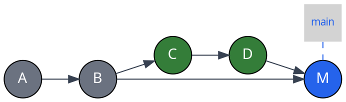
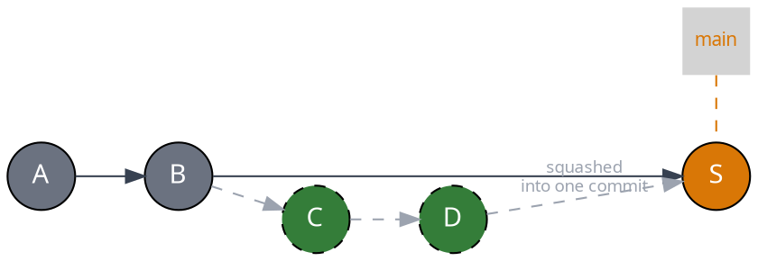
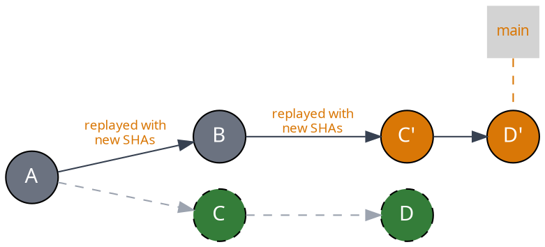
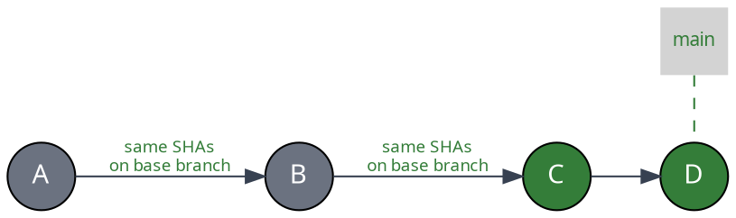
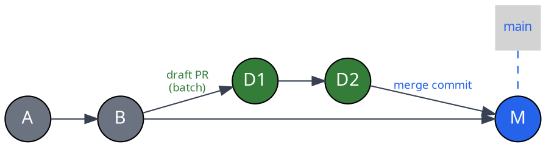

import { Image } from "astro:assets"
import requiredPRbypassScreenshot from "../../images/merge-queue/batches/mergify-required-pull-request-bypass.png"

The `merge_method` option in your queue rules controls how Mergify merges pull
requests into your base branch. Each method produces a different git history
shape, with trade-offs between linearity, SHA preservation, and throughput.

## Merge Methods at a Glance

| Method | History | Commits on base branch | SHAs preserved | Queue parallelism |
|---|---|---|---|---|
| `merge` | Non-linear | Original commits + merge commit | Yes | Full |
| `squash` | Linear | 1 new commit per PR | No | Full |
| `rebase` | Linear | Recreated copies of each commit | No | Full |
| `fast-forward` | Linear | Original commits moved to base | Yes | Serial only |
| `merge-batch` | Non-linear | Draft branch commits + 1 merge commit per batch | No | Full |

## Merge (Default)

```yaml
queue_rules:
  - name: default
    merge_method: merge
```

Creates a merge commit joining the PR branch into the base branch. This is the
default GitHub merge behavior.



- **History:** non-linear — the PR branch and base branch are visible as
  separate lines in `git log --graph`

- **Merge commits:** yes — each PR produces a merge commit on the base branch

- **SHAs preserved:** yes — original PR commits keep their SHAs

- **Use case:** most teams; simplest setup with no constraints on parallelism
  or batching

## Squash

```yaml
queue_rules:
  - name: default
    merge_method: squash
```

Squashes all PR commits into a single commit on the base branch.



- **History:** linear — one commit per PR on the base branch
- **Merge commits:** no
- **SHAs preserved:** no — a new commit is created
- **Use case:** teams that want a clean `git log` where one commit = one PR

## Rebase

```yaml
queue_rules:
  - name: default
    merge_method: rebase
```

Replays each PR commit on top of the base branch, creating new commits with new
SHAs.



- **History:** linear — no merge commits, individual commits are preserved

- **Merge commits:** no

- **SHAs preserved:** no — commits are recreated with new SHAs, so the PR
  branch ref won't match the base branch

- **Use case:** teams that want linear history with individual commits visible,
  but don't need SHA preservation

## Fast-Forward

```yaml
queue_rules:
  - name: default
    merge_method: fast-forward
```

Fast-forward merging advances the base branch ref directly to the tested
commit(s) using the Git API instead of creating a merge via GitHub. The exact
behavior depends on whether the queue operates in
[inplace or draft-PR mode](/merge-queue/parallel-checks#important-considerations).

### Inplace Mode

The PR is rebased on top of the base branch, CI runs on the PR itself, and
the base branch ref is fast-forwarded to the PR's head commit.

In this mode, `update_method` must be set to `rebase` (the default). If a
rebase update occurs, the commit SHAs on the PR will change — what fast-forward
preserves are the SHAs of the PR branch at merge time.

:::caution
  When using `update_bot_account` with fast-forward inplace mode, fork pull
  requests will no longer be supported after **July 1, 2026**. See the
  [update method deprecation note](#combining-merge-and-update-methods) for
  details and migration options.
:::



- **History:** strictly linear — commits sit directly on the base branch

- **Merge commits:** none

- **SHAs preserved:** yes — the exact same commit SHAs from the PR appear on
  the base branch

### Draft-PR Mode

Mergify creates a draft PR that combines the queued pull requests, runs CI on
that draft, and then fast-forwards the base branch to the draft PR's head
commit.

Because the draft branch combines multiple PRs, the history **may contain merge
commits** from folding each PR into the draft branch.

- **History:** linear at the base-branch level, but individual merge commits
  from combining PRs may appear

- **Merge commits:** possible — from combining PRs in the draft branch

- **SHAs preserved:** the final merged result is the exact SHA tested by CI

### Constraints

- **`commit_message_template` must not be set** — fast-forward preserves
  the original commits, so custom commit messages are not applicable

- **[Parallel mode](/merge-queue/parallel-scopes) is not supported** — fast-forward
  is not compatible with scope-based parallel queues

- **Use case:** teams and OSS projects that care about commit identity and want
  the exact CI-tested code on their base branch

:::caution
  Fast-forward requires Mergify to push directly to the base branch without
  going through a pull request merge. If GitHub branch protections are enabled,
  you must allow Mergify to **bypass the required pull requests** setting.

  <Image src={requiredPRbypassScreenshot} alt="Mergify bypass required pull requests" />
:::

### Examples

Inplace mode — strictly linear history with preserved commit SHAs:

```yaml
merge_queue:
  max_parallel_checks: 1

queue_rules:
  - name: default
    merge_method: fast-forward
    batch_size: 1
    merge_conditions:
      - check-success = ci
```

Draft-PR mode — batching with fast-forward merge:

```yaml
queue_rules:
  - name: default
    merge_method: fast-forward
    batch_size: 5
    merge_conditions:
      - check-success = ci
```

## Merge Batch

```yaml
queue_rules:
  - name: default
    merge_method: merge-batch
    batch_size: 5
    merge_conditions:
      - check-success = ci
```

When `merge_method` is set to `merge-batch`, Mergify merges the draft pull
request it creates for batching directly into the base branch using a merge
commit — instead of merging the original pull requests individually.

This is similar to `fast-forward` in that the draft PR itself is merged, but
uses the GitHub Pull Request merge API rather than advancing the git ref
directly. The resulting merge commit message identifies which pull requests
were included in the batch (e.g., "Merge queue: merged #42, #43, #44").



- **History:** non-linear — a single merge commit per batch appears on the base
  branch

- **Merge commits:** yes — one merge commit per batch, not per PR

- **SHAs preserved:** no — the batch merge commit is new, and the original PR
  commit SHAs are not preserved because the draft PR contains recreated commits

- **Requires `batch_size > 1`** — this method is designed for batch merging and
  cannot be used with single PRs

- **Not compatible with [partition rules](/merge-queue/parallel-scopes)**

- **Use case:** teams that use batch merging and want a single merge commit per
  batch on the base branch, triggering only one deployment per batch

:::note
  Unlike `fast-forward`, `merge-batch` uses the standard GitHub Pull Request
  merge API, so it works with branch protection settings that require pull
  request merges. No bypass configuration is needed.
:::

## Combining Merge and Update Methods

The `update_method` option controls how Mergify updates PR branches when they
fall behind the base branch. Combining `merge_method` with `update_method`
gives you additional control over your history shape.

:::note
  `update_method: rebase` combined with `update_bot_account` will no longer
  support fork pull requests after **July 1, 2026**. If your repository
  receives fork PRs, use `update_method: merge` instead.
:::

### Semi-Linear History (Rebase + Merge Commit)

```yaml
queue_rules:
  - name: default
    merge_method: merge
    update_method: rebase
```

PRs are rebased on top of the base branch before being merged with a merge
commit. This produces a history where individual commits are linear, but each
PR is wrapped in a merge commit that marks the PR boundary.

- **Use case:** teams that want linear commits but also want merge commits as
  PR boundary markers in `git log --graph`

### Linear History via Rebase Update

```yaml
queue_rules:
  - name: default
    merge_method: rebase
    update_method: rebase
```

PRs are rebased to stay current, then rebased again at merge time. This
produces a fully linear history with no merge commits, though SHAs will differ
from the original PR branch.

## Choosing the Right Strategy

| I want... | `merge` | `squash` | `rebase` | `fast-forward` | `merge-batch` |
|---|:---:|:---:|:---:|:---:|:---:|
| Linear history | | ✔ | ✔ | ✔ | |
| Preserved commit SHAs | ✔ | | | ✔ | |
| One commit per PR | | ✔ | | | |
| One commit per batch | | | | | ✔ |
| Individual PR commits visible | ✔ | | ✔ | ✔ | |
| See PR boundaries in `git log` | ✔ | | | | |
| [Batches](/merge-queue/batches) and [parallel checks](/merge-queue/parallel-checks) | ✔ | ✔ | ✔ | | ✔ |
| Single deployment per batch | | | | ✔ | ✔ |
