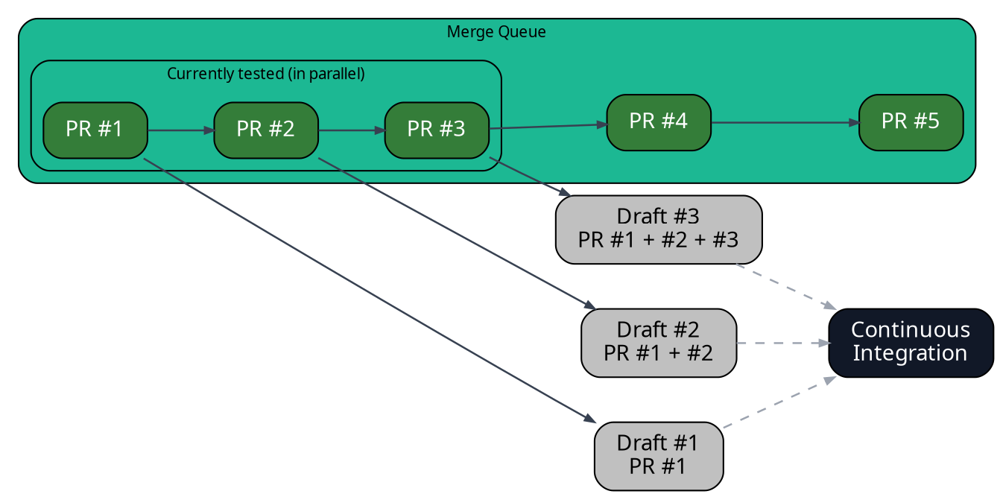

import { Image } from "astro:assets"
import specChecksListScreenshot from "../../images/merge-queue/parallel-checks/spec-checks-list.png"

Parallel Checks let Mergify test multiple queued pull requests together so you
ship faster. Mergify creates temporary draft PRs that represent cumulative
merges (PR#1), (PR#1+PR#2), (PR#1+PR#2+PR#3), runs CI on them in parallel, then
merges the original PRs once checks pass.

## How Parallel Checks Work

Mergify groups PRs by their position in the queue and the `max_parallel_checks`
value. It creates draft PRs that speculatively combine changes and runs your CI
on each in parallel. For example, with PR #1–#5 and `max_parallel_checks: 3`,
Mergify creates:

- Draft #1: PR #1
- Draft #2: PR #1 + PR #2
- Draft #3: PR #1 + PR #2 + PR #3



This validates the combined outcome ahead of time against your `queue_rules`.
If a draft fails, Mergify removes the culprit PR from the queue and continues
with the rest.

<Image src={specChecksListScreenshot} alt="Mergify parallel checks" />

The result: fewer head‑of‑line stalls, faster merges, and earlier detection of
incompatibilities.

:::note
  Mergify merges the original PRs, not the temporary drafts. If you prefer
  merging the draft PRs instead, see [Merging the Draft
  PRs](/merge-queue/batches#merging-the-draft-prs).
:::

## Configuring Parallel Checks

Set `merge_queue.max_parallel_checks` to control how many speculative checks run at once:

```yaml
merge_queue:
  max_parallel_checks: 3
```
This example runs up to 3 speculative checks simultaneously. Tune this number
to match your CI capacity and typical PR size/complexity.

## When Things Change

Parallel Checks adapt automatically as your code and rules evolve:

- Failed checks: Mergify removes the failing PR and continues with the rest.

- PR or rule changes: affected PRs are re-evaluated and re-embarked in order.

- Base branch updates: checks restart on the new base; configurable via
  `reset_on_external_merge` — see [Lifecycle: Base Branch
  Updates](/merge-queue/lifecycle#base-branch-updates).

## Important Considerations

### Branch Protection Settings

Parallel checks operate by creating temporary pull requests, which merge
multiple PRs with the base branch. This process requires the branch protection
setting `Require branches to be up to date before merging` to be disabled.

This does not mean that Mergify will test outdated PRs, but it will merge the
original pull requests once its parallel checks is finished. The original PR
won't be up-to-date according to GitHub, which means using this setting would
block the merge.

### Tuning parallel checks

Adjust `max_parallel_checks` to balance throughput and CI usage. Higher values
increase concurrency; choose a value your CI can handle reliably. For deeper
guidance and trade‑offs (including batching), see [Merge queue
performance](/merge-queue/performance).
