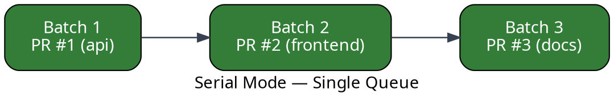
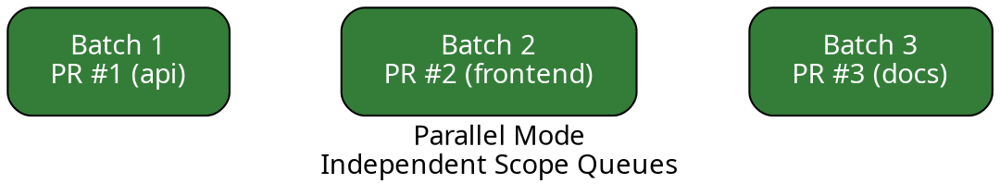
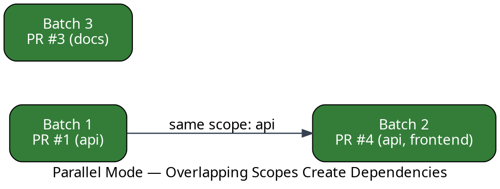
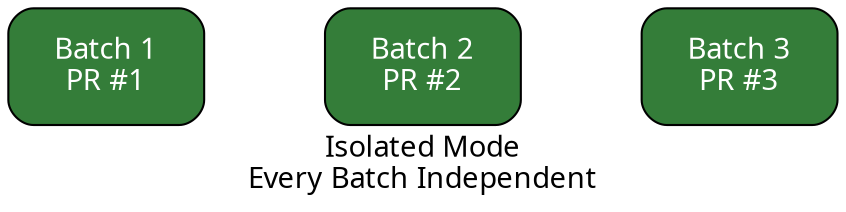

By default, Mergify's merge queue operates in **serial mode**: every pull request is tested on top
of the previous one, forming a single ordered pipeline. This guarantees correctness but means
unrelated changes wait for each other.

**Parallel mode** removes that constraint. When two pull requests touch different areas of the
codebase — different **scopes** — Mergify tests and merges them independently, at the same time. Pull
requests that do share a scope are still queued together so they are tested as a group, preventing
semantic conflicts.

:::tip
  Parallel mode is designed for monorepos and large repositories where pull requests frequently
  change independent parts of the codebase. If most of your pull requests touch the same files,
  serial mode with [batching](/merge-queue/batches) may be a better fit.
:::

**Isolated mode** goes one step further. Every batch runs as a fully independent unit with no
dependency on any other batch — even when their changes overlap. Scopes become optional: when set,
Mergify groups similar pull requests into the same batch; when omitted, it batches by priority and
arrival order. See [Isolated Mode](#isolated-mode) below.

## Serial, Parallel, and Isolated at a Glance

In **serial mode**, every batch depends on the one before it. Even if PR #3 (docs) has nothing in
common with PR #1 (api) or PR #2 (frontend), it still waits:



In **parallel mode**, Mergify groups pull requests by scope. Batches that share no scope run at the
same time:



When scopes **do** overlap, Mergify preserves ordering within that scope to guarantee the changes are
tested together:



Here PR #4 touches the `api` scope, just like PR #1 — so it must wait for PR #1 to merge first.
Meanwhile PR #3 (docs) proceeds independently.

In **isolated mode**, there are no dependencies at all. Every batch runs on its own, even when two
batches touch the same code, so an overlap like the one above never creates a wait:



## Setting Up Parallel Mode

Parallel mode requires two things: switching the queue mode and configuring
[scopes](/merge-queue/scopes) so Mergify knows which areas of the codebase each pull request
touches.

### 1. Define scopes

Scopes can come from file patterns declared directly in `.mergify.yml`, or from an external build
system (Nx, Bazel, Turborepo, …) via the
[`gha-mergify-ci`](https://github.com/Mergifyio/gha-mergify-ci) GitHub Action.

```yaml
scopes:
  source:
    files:
      api:
        include:
          - services/api/**/*
      frontend:
        include:
          - apps/web/**/*
      docs:
        include:
          - docs/**/*
```

See [Scopes](/merge-queue/scopes) for all configuration options and build-tool integrations.

### 2. Enable parallel mode

Add `mode: parallel` under `merge_queue`:

```yaml
merge_queue:
  mode: parallel
  max_parallel_checks: 5

scopes:
  source:
    files:
      api:
        include:
          - services/api/**/*
      frontend:
        include:
          - apps/web/**/*
      docs:
        include:
          - docs/**/*

queue_rules:
  - name: default
    batch_size: 3
    queue_conditions:
      - check-success = ci
```

The `max_parallel_checks` setting controls how many batches Mergify tests at the same time across
all scope queues. Tune it to match your CI capacity.

## How It Works

Once parallel mode is active, the merge queue follows these steps whenever it processes pull
requests:

1. **Scope assignment.** Each pull request is tagged with the scopes it affects, either
   automatically from file patterns or via an external upload.

2. **Batch formation.** Mergify groups pull requests that share **exactly the same set of scopes**
   into batches (respecting `batch_size`). Pull requests with different scopes form separate
   batches.

3. **Dependency tracking.** Batches that share at least one scope are linked as parent → child in a
   dependency graph. A child batch cannot merge until all its parents have merged.

4. **Parallel execution.** Batches with no shared scopes — and therefore no dependency — are tested
   by CI at the same time, up to `max_parallel_checks`.

5. **Merge.** As soon as a batch's CI passes and all its parent batches are merged, Mergify merges
   the pull requests in that batch.

### What happens when a batch fails?

The failure handling works the same way as in serial mode: Mergify splits the failed batch and
retests the parts to isolate the problematic pull request. See
[Handling Batch Failures](/merge-queue/batches#handling-batch-failure-or-timeout) for details.

Because batches in parallel mode are scoped, a failure in one scope queue does **not** block
unrelated scope queues. Only batches that depend on the failed one (via shared scopes) are affected.

## The Monorepo Trade-Off

Parallel mode is built for the reality of monorepos: most pull requests are independent, but some
do interact.

| Scenario | What happens | Benefit |
|----------|-------------|---------|
| PRs touch **different** scopes | Tested and merged in parallel | Faster merge times — no waiting for unrelated work |
| PRs touch **the same** scope | Ordered within that scope queue and tested together | Conflicts caught before merge |
| A PR touches **multiple** scopes | Linked to all relevant scope queues | Correctness preserved across scopes |

The net effect: **pull requests merge faster when their scopes don't collide**, while pull requests
that do collide are still tested in the right order to avoid semantic conflicts reaching your main
branch.

## Isolated Mode

Parallel mode keeps dependencies between batches that share a scope. **Isolated mode** drops them
entirely: every batch is a self-contained unit that is tested and merged on its own, with no parent
batch and no child batch. A failure in one batch never blocks any other.

Use isolated mode when your pull requests are genuinely independent and you want maximum throughput
without maintaining a scope map — for example when each pull request targets its own service or
package and you don't need Mergify to serialize overlapping changes.

### Enable isolated mode

Set `mode: isolated` under `merge_queue`. Unlike parallel mode, scopes are **optional**:

```yaml
merge_queue:
  mode: isolated
  max_parallel_checks: 5

queue_rules:
  - name: default
    batch_size: 5
    queue_conditions:
      - check-success = ci
```

### How batches form

How Mergify fills a batch depends on whether you configure
[scopes](/merge-queue/scopes):

- **With scopes.** Mergify groups the most similar pull requests — those sharing the most scopes —
  into the same batch, using the same [scope-aware batching](/merge-queue/scopes) as the other
  modes. This keeps related changes tested together and maximizes CI reuse.

- **Without scopes.** Mergify fills batches by queue priority and arrival order, up to `batch_size`.

Either way, the batches that result are fully independent. They run concurrently up to
`max_parallel_checks`, and Mergify merges each one as soon as its own CI passes — there is never a
parent batch to wait for.

### Isolated vs. parallel

| | Parallel mode | Isolated mode |
|--|--|--|
| Scopes | Required | Optional |
| Cross-batch dependencies | Yes, when scopes overlap | Never |
| A batch can block another | Yes (shared scope) | No |
| Batch formation | By shared scopes | By shared scopes, or by priority + arrival order when no scopes |

Batch failure handling is the same as in the other modes: Mergify splits the failed batch and
retests the parts to isolate the culprit. See
[Handling Batch Failures](/merge-queue/batches#handling-batch-failure-or-timeout).

## Compatibility and Limitations

Parallel and isolated modes change how the queue operates. Some features that rely on strict
single-queue ordering are not available:

- **Scopes are required in parallel mode.** You must configure `scopes.source` (either `files` or
  `manual`) so Mergify can tell which pull requests are independent. Isolated mode does not require
  scopes — see [Isolated Mode](#isolated-mode).

- **`fast-forward` merge is not supported.** Because batches merge independently, Mergify needs to
  rebase them. Use `merge` or `rebase` as your `merge_method`.

- **`skip_intermediate_results` is not available.** This feature depends on the strict cumulative
  ordering of serial mode.

- **`partition_rules` are not supported.** Partitions rely on serial ordering; use scopes instead.

## Next Steps

- [Scopes](/merge-queue/scopes): learn how to define and manage scopes for your repository.

- [Batches](/merge-queue/batches): understand batch formation, sizing, and failure handling.

- [Performance](/merge-queue/performance): tune your queue for the right balance of speed, cost,
  and reliability.

- [Monorepo](/merge-queue/monorepo): broader guidance on using Mergify in monorepo setups.
