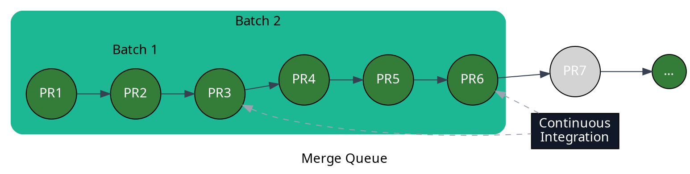

import MergeQueueCalculator from "../../../components/MergeQueueCalculator/MergeQueueCalculator"

Tune parallel checks, batch size, and CI scope to balance throughput, reliability, and CI cost.

:::tip
  Scaling to 20+ PRs per day? The [Merge Queue Academy's high-velocity teams
  guide](https://merge-queue.academy/use-cases/high-velocity-teams/) covers
  health metrics and optimization strategies for fast-moving teams.
:::

### The Trade-offs: Reliability, Cost, and Velocity (RCV Theorem)

A merge queue can only optimize two of three properties at a time: reliability
(merges don't break main), cost (CI jobs executed), and velocity (throughput
and latency). We call this the **RCV theorem**, analogous to the
[CAP theorem](https://en.wikipedia.org/wiki/CAP_theorem) for data stores.

The three viable combinations:

- **Reliability + Velocity**: enable **[parallel speculative
  checks](/merge-queue/parallel-checks)** to test predicted merge states
  concurrently. Wasted CI runs occur when a PR ahead in the queue fails.

- **Reliability + Cost**: validate pull requests sequentially. No wasted CI,
  but throughput is capped at one PR per CI run.

- **Velocity + Cost**: use [batch mode](/merge-queue/batches) to test groups
  of PRs as a single unit. Fewer CI runs, but hidden failures inside a passing
  batch can land on main.

Parallel checks and batching can be combined for a middle ground across all
three dimensions.

### Determining the Right Configuration for Parallel Checks and Batching

Weigh these factors when picking `batch_size` and `max_parallel_checks`:

1. **Merge throughput and queue latency**: target settings that match your
   historical merges-per-hour and keep PR wait time acceptable.

2. **Peak load**: size for peak developer hours, not averages, so the queue
   doesn't back up during busy windows.

3. **CI capacity and job duration**: fast CI and abundant runners tolerate
   higher parallelism; slow CI or constrained runners need a conservative
   setting, since reruns on failure are expensive.

4. **Change stability**: repositories with frequent flaky or failing PRs
   should lower batch size and parallelism to limit wasted work.

5. **Team distribution**: globally distributed teams produce a steady PR flow;
   concentrated teams spike and need headroom for bursts.

### Performance Configuration Calculator

Provide the inputs below and the calculator will suggest a configuration:

1. **CI time in minutes**: average duration of a CI run.

2. **Estimated CI success ratio in %**: how often CI passes (e.g. 95 if 95
   out of 100 runs succeed).

3. **Desired PRs to merge per hour**: target throughput.

4. **Desired CI usage in %**: 100% matches a standard queue. Below 100%
   favors batching to conserve CI; above 100% favors parallel checks for
   lower latency at higher CI cost.

<MergeQueueCalculator client:only="react"/>

:::note
  - This calculator optimizes CI usage and throughput but not latency.
    If you want to further optimize latency, you need to increase
    the number of parallel checks.

  - The average latency computing assumes that the number of PR merged per hour
    enters the queue at the beginning of the hour.

  - CI time is an important factor in those computing. If you want to optimize
    latency and throughput, you should make sure your CI time is as low and
    optimized as possible.
:::

## Optimizing Merge Queue Time with Efficient CI Runs

Every minute shaved off CI compounds across every queued PR. Run only the
tests required for the change under test.

The [**Two-step CI**](/merge-queue/two-step) method splits validation into:

1. **Preliminary tests**: fast checks run when a PR is created or updated,
   gating entry into the queue.

2. **Pre-merge tests**: exhaustive checks run just before merge.

This keeps queue-time CI short without sacrificing final-merge confidence.

## Combining Batch Merging and Parallel Checks

[Batch merging](/merge-queue/batches) tests multiple PRs as a single unit.
[Parallel checks](/merge-queue/parallel-checks) run several batches
concurrently. Together, they maximize CI utilization: if any PR in a batch
fails, [Mergify binary-searches for the culprit, removes it, and continues
processing](/merge-queue/batches#handling-batch-failure-or-timeout).

```yaml
merge_queue:
  max_parallel_checks: 2

queue_rules:
  - name: default
    batch_size: 3
    ...
```

With `batch_size: 3` and `max_parallel_checks: 2`, Mergify runs up to 2
batches of up to 3 PRs each in parallel. Given 7 queued PRs and a 10-minute
CI pipeline, the first 6 merge in 10 minutes instead of the hour required for
sequential validation.


