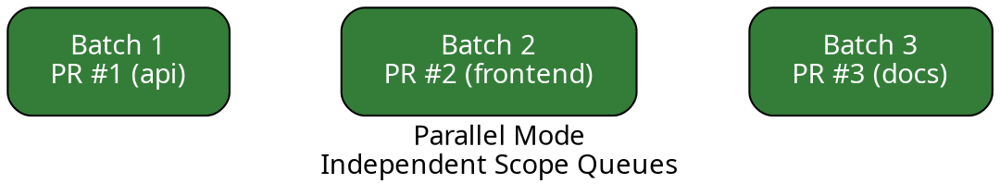
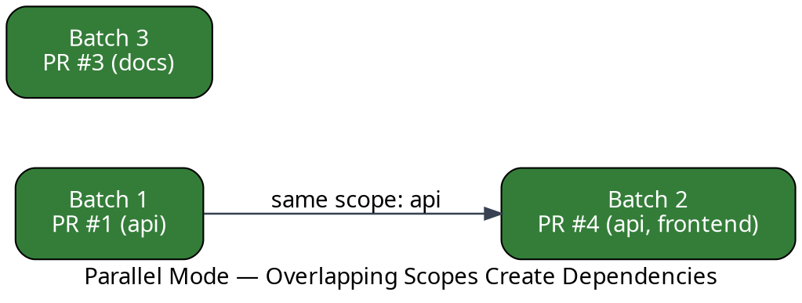
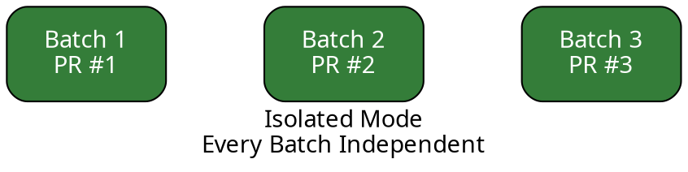

The `merge_queue.mode` option controls how the merge queue schedules pull requests. There are three
modes:

- **`serial`** (default) — every pull request is tested on top of the previous one, in a single
  ordered pipeline.

- **`parallel`** — pull requests that touch different [scopes](/merge-queue/scopes) are tested and
  merged at the same time.

- **`isolated`** — every batch runs as a fully independent unit, with no dependency on any other
  batch.

All three honor your [queue rules](/merge-queue/rules) and [batch sizing](/merge-queue/batches).
They differ only in **how batches depend on each other**.

## Choosing a mode

| Mode | Batches depend on each other? | PRs tested against each other? | Requires scopes? | Best for |
|------|-------------------------------|-------------------------------|------------------|----------|
| `serial` | Yes, builds on the previous batch | Yes, every PR cumulatively | No | Repos where PRs touch the same code |
| `parallel` | Only when scopes overlap | Only PRs sharing a scope | Yes | Monorepos where PRs touch independent areas |
| `isolated` | Never | No, only against the base branch | No | Independent PRs, max throughput, accept conflict risk |

The rest of this page describes each mode in turn. Serial is the default, so if you do nothing you
are already using it.

## Serial Mode

Serial mode is the **default** — you don't need to configure anything to use it. Every pull request
is tested on top of the one before it, forming a single ordered pipeline. This guarantees
correctness: each pull request is validated against the exact state it will merge into. The
trade-off is that unrelated changes still wait for each other.


Even though PR #3 (docs) has nothing in common with PR #1 (api) or PR #2 (frontend), it still waits
behind them.

You can set it explicitly, though it is the default:

```yaml
merge_queue:
  mode: serial
```

Serial mode still uses [batches](/merge-queue/batches) and
[parallel checks](/merge-queue/performance#parallel-checks) to increase throughput without giving up cumulative
testing. If most of your pull requests touch the same files, serial mode is usually the right
choice.

## Parallel Mode

Parallel mode tests and merges pull requests that touch different areas of the codebase — different
[scopes](/merge-queue/scopes) — at the same time. Pull requests that share a scope are still queued
together so they are tested as a group, preventing semantic conflicts.

:::tip
  Parallel mode is designed for monorepos and large repositories where pull requests frequently
  change independent parts of the codebase. If most of your pull requests touch the same files,
  serial mode may be a better fit.
:::

:::note
  Parallel **mode** is not the same as [parallel checks](/merge-queue/performance#parallel-checks). Parallel
  mode is about **scopes**: independent queues that don't wait on each other. Parallel checks are
  **speculative** CI that test queued pull requests ahead of time within a single ordered queue,
  and they run in serial mode too. The two are configured separately and work together.
:::

Batches that share no scope run at the same time:



When scopes **do** overlap, Mergify preserves ordering within that scope to guarantee the changes are
tested together:



Here PR #4 touches the `api` scope, just like PR #1 — so it must wait for PR #1 to merge first.
Meanwhile PR #3 (docs) proceeds independently.

### Set up parallel mode

Parallel mode requires two things: configuring [scopes](/merge-queue/scopes) so Mergify knows which
areas of the codebase each pull request touches, and switching the mode.

#### 1. Define scopes

Scopes can come from file patterns declared directly in `.mergify.yml`, or from an external build
system (Nx, Bazel, Turborepo, …) via the
[`gha-mergify-ci`](https://github.com/Mergifyio/gha-mergify-ci) GitHub Action.

```yaml
scopes:
  source:
    files:
      api:
        include:
          - services/api/**/*
      frontend:
        include:
          - apps/web/**/*
      docs:
        include:
          - docs/**/*
```

See [Scopes](/merge-queue/scopes) for all configuration options and build-tool integrations.

#### 2. Enable parallel mode

Add `mode: parallel` under `merge_queue`:

```yaml
merge_queue:
  mode: parallel
  max_parallel_checks: 5

scopes:
  source:
    files:
      api:
        include:
          - services/api/**/*
      frontend:
        include:
          - apps/web/**/*
      docs:
        include:
          - docs/**/*

queue_rules:
  - name: default
    batch_size: 3
    queue_conditions:
      - check-success = ci
```

The `max_parallel_checks` setting controls how many batches Mergify tests at the same time across
all scope queues. Tune it to match your CI capacity.

### How parallel mode works

Once parallel mode is active, the merge queue follows these steps whenever it processes pull
requests:

1. **Scope assignment.** Each pull request is tagged with the scopes it affects, either
   automatically from file patterns or via an external upload.

2. **Batch formation.** Mergify groups pull requests that share **exactly the same set of scopes**
   into batches (respecting `batch_size`). Pull requests with different scopes form separate
   batches.

3. **Dependency tracking.** Batches that share at least one scope are linked as parent → child in a
   dependency graph. A child batch cannot merge until all its parents have merged.

4. **Parallel execution.** Batches with no shared scopes — and therefore no dependency — are tested
   by CI at the same time, up to `max_parallel_checks`.

5. **Merge.** As soon as a batch's CI passes and all its parent batches are merged, Mergify merges
   the pull requests in that batch.

When a batch fails, Mergify splits it and retests the parts to isolate the problematic pull request
(see [Handling Batch Failures](/merge-queue/batches#handling-batch-failure-or-timeout)). Because
batches are scoped, a failure in one scope queue does **not** block unrelated scope queues — only
batches that depend on the failed one (via a shared scope) are affected.

### Limiting concurrency per scope

`max_parallel_checks` caps how many speculative checks run at once across **all** scopes. Sometimes
you want to bound a **single** scope on top of that: a scope whose tests are expensive or hit a shared
resource that can't take many concurrent runs (a staging environment or a rate-limited external
service), while the rest of your scopes can use whatever capacity the global ceiling leaves them.

`scopes.capacities` maps a scope name to the number of speculative checks that scope may run at the
same time:

```yaml
merge_queue:
  mode: parallel
  max_parallel_checks: 5

scopes:
  source:
    files:
      frontend:
        include:
          - apps/web/**/*
      backend:
        include:
          - services/api/**/*
      docs:
        include:
          - docs/**/*
  capacities:
    frontend: 2
    backend: 2
```

Here `frontend` and `backend` are each limited to 2 concurrent speculative checks. `docs` is absent
from the map, so it stays uncapped: only the global ceiling applies to it.

#### How capacities relate to the global ceiling

`max_parallel_checks` is the **global ceiling**: the most speculative checks a train will ever run at
once. Each `scopes.capacities` entry is a **sub-limit inside that ceiling, not an extra budget on
top of it**:

- A speculative check consumes one global slot **and** one slot in every capped scope its batch
  belongs to.

- It starts only when the global ceiling has room **and** each of its capped scopes has room.

- A scope that isn't listed in `capacities` is unlimited; it draws on the global ceiling alone.

Because every check always takes a global slot, the total running at once **never exceeds
`max_parallel_checks`**, whatever you put in `capacities`. Capacities can only ever hold a scope
below the global ceiling; they never raise the total, so adding them to an existing configuration
cannot increase your CI load.

#### Worked example

Take the configuration above (`max_parallel_checks: 5`, `frontend: 2`, `backend: 2`, `docs`
uncapped) and suppose the queue is ready to test three `frontend` batches, three `backend` batches,
and two `docs` batches. The slots might fill like this:

```dot class="graph"
strict digraph {
  fontname="sans-serif";
  rankdir="TB";
  label="Per-scope capacities — ceiling 5, frontend: 2, backend: 2, docs uncapped";
  nodesep=0.5;
  ranksep=0.7;

  node [shape=box, style="rounded,filled", fontcolor="white", fontname="sans-serif", margin="0.3,0.18"];
  edge [style=invis];

  subgraph cluster_running {
    style="rounded,filled";
    fillcolor="#1CB893";
    color="#1CB893";
    fontcolor="#000000";
    label="Running now — 5 of 5 slots used";

    F1 [label="frontend #1", fillcolor="#347D39"];
    F2 [label="frontend #2", fillcolor="#347D39"];
    B1 [label="backend #1", fillcolor="#347D39"];
    B2 [label="backend #2", fillcolor="#347D39"];
    D1 [label="docs #1", fillcolor="#347D39"];

    { rank=same; F1; F2; B1; B2; D1; }
  }

  subgraph cluster_waiting {
    style="rounded";
    color="#6B7280";
    fontcolor="#6B7280";
    label="Waiting";

    F3 [label="frontend #3\nfrontend full", fillcolor="#6B7280"];
    B3 [label="backend #3\nbackend full", fillcolor="#6B7280"];
    D2 [label="docs #2\nceiling full", fillcolor="#6B7280"];

    { rank=same; F3; B3; D2; }
  }
}
```



- `frontend` and `backend` each run at most 2 batches, so each holds back its third; those wait for
  a free slot in their own scope.

- `docs` is uncapped, but only as many `docs` batches run as there is room under the ceiling of 5.
  Here that is 1, so the second `docs` batch waits, not because `docs` is capped (it isn't) but
  because the global ceiling is full.

Two things always hold: no capped scope runs more than its limit, and no more than
`max_parallel_checks` run at once. Exactly which batches fill the slots, and whether the last free
slot goes to `docs` or to a capped scope still below its limit, follows queue order, so the split
can differ from one cycle to the next. As soon as a running check finishes, its freed global slot
(and its freed scope slot, if any) go to the next waiting batch that fits both.

#### Pull requests in several scopes

A batch that touches more than one capped scope must fit in **all** of them at once. A batch
carrying both `frontend` and `backend` consumes one `frontend` slot and one `backend` slot, and
starts only when both scopes, and the global ceiling, have room. This keeps every scope's limit
honored even when changes span scopes.

The extreme case is a pull request [flagged with
`all_scopes`](/merge-queue/scopes#declaring-a-pull-request-impacts-every-scope): it consumes one
slot in every capped scope and acts as a barrier, so nothing runs in parallel with it.

#### Source-agnostic

`capacities` only sets the limit; it does not decide which pull requests belong to a scope.
Membership comes from your [`scopes.source`](/merge-queue/scopes), so capacities behave the same
whether scopes are derived from [file patterns](/merge-queue/scopes/file-patterns) (`source: files`)
or pushed from an external build system (`source: manual`). You declare the limit once, no matter how
membership is computed.

:::note
  Strict branch protection (*Require branches to be up to date before merging*) clamps the whole
  train to one check at a time, so each scope's effective capacity becomes 1 and `capacities` has no
  further effect. See [Require Branches to Be Up to
  Date](/merge-queue/github-rulesets#require-branches-to-be-up-to-date).
:::

### The monorepo trade-off

Parallel mode is built for the reality of monorepos: most pull requests are independent, but some
do interact.

| Scenario | What happens | Benefit |
|----------|-------------|---------|
| PRs touch **different** scopes | Tested and merged in parallel | Faster merge times — no waiting for unrelated work |
| PRs touch **the same** scope | Ordered within that scope queue and tested together | Conflicts caught before merge |
| A PR touches **multiple** scopes | Linked to all relevant scope queues | Correctness preserved across scopes |

The net effect: **pull requests merge faster when their scopes don't collide**, while pull requests
that do collide are still tested in the right order to avoid semantic conflicts reaching your base
branch.

## Isolated Mode

Parallel mode keeps dependencies between batches that share a scope. **Isolated mode** drops them
entirely: every batch is a self-contained unit that is tested and merged on its own, with no parent
batch and no child batch. A failure in one batch never blocks any other.



Use isolated mode when your pull requests are genuinely independent and you want maximum throughput
without maintaining a scope map — for example when each pull request targets its own service or
package and you don't need Mergify to serialize overlapping changes.

:::caution
  Isolated mode never tests pull requests against each other. Two pull requests that pass on their
  own but conflict semantically can both merge and break your base branch. Parallel mode protects
  against this by serializing pull requests that share a scope; isolated mode drops that safety net.
  Use it only when your pull requests are truly independent.
:::

### Enable isolated mode

Set `mode: isolated` under `merge_queue`. Unlike parallel mode, scopes are **optional**:

```yaml
merge_queue:
  mode: isolated
  max_parallel_checks: 5

queue_rules:
  - name: default
    batch_size: 5
    queue_conditions:
      - check-success = ci
```

:::caution
  Isolated mode requires speculative checks to be useful: `max_parallel_checks` must be greater
  than 1. With `max_parallel_checks: 1` (speculative checks disabled), batches still run
  one at a time. You get no throughput gain and lose serial mode's cumulative testing. If you can't
  run speculative checks, use `serial` instead.
:::

### How isolated batches form

How Mergify fills a batch depends on whether you configure [scopes](/merge-queue/scopes):

- **With scopes.** Mergify groups the most similar pull requests — those sharing the most scopes —
  into the same batch, using the same [scope-aware batching](/merge-queue/scopes) as the other
  modes. This keeps related changes tested together and maximizes CI reuse.

- **Without scopes.** Mergify fills batches by queue priority and arrival order, up to `batch_size`.

Either way, the resulting batches are fully independent. They run concurrently up to
`max_parallel_checks`, and Mergify merges each one as soon as its own CI passes — there is never a
parent batch to wait for. Batch failures are handled the same way as in the other modes (see
[Handling Batch Failures](/merge-queue/batches#handling-batch-failure-or-timeout)).

## Compatibility and Limitations

Parallel and isolated modes change how the queue operates, so some features behave differently or
aren't available depending on the mode:

- **Scopes are required in parallel mode.** You must configure `scopes.source` (either `files` or
  `manual`) so Mergify can tell which pull requests are independent. Serial and isolated modes do
  not require scopes.

- **`fast-forward` merge is not supported.** Because batches merge independently, Mergify needs to
  rebase them. Use `merge` or `rebase` as your `merge_method`.

- **`skip_intermediate_results` is not supported in isolated mode.** Isolated batches are fully
  independent, so a passing batch can't vouch for any other. It works in serial and parallel modes,
  where a passing batch vouches for the earlier changes it was tested on top of.

- **`partition_rules` are not supported.** Partitions rely on serial ordering; use scopes instead.

## Next Steps

- [Scopes](/merge-queue/scopes): learn how to define and manage scopes for your repository.

- [Batches](/merge-queue/batches): understand batch formation, sizing, and failure handling.

- [Performance](/merge-queue/performance): tune your queue for the right balance of speed, cost,
  and reliability.

- [Monorepo](/merge-queue/monorepo): broader guidance on using Mergify in monorepo setups.
