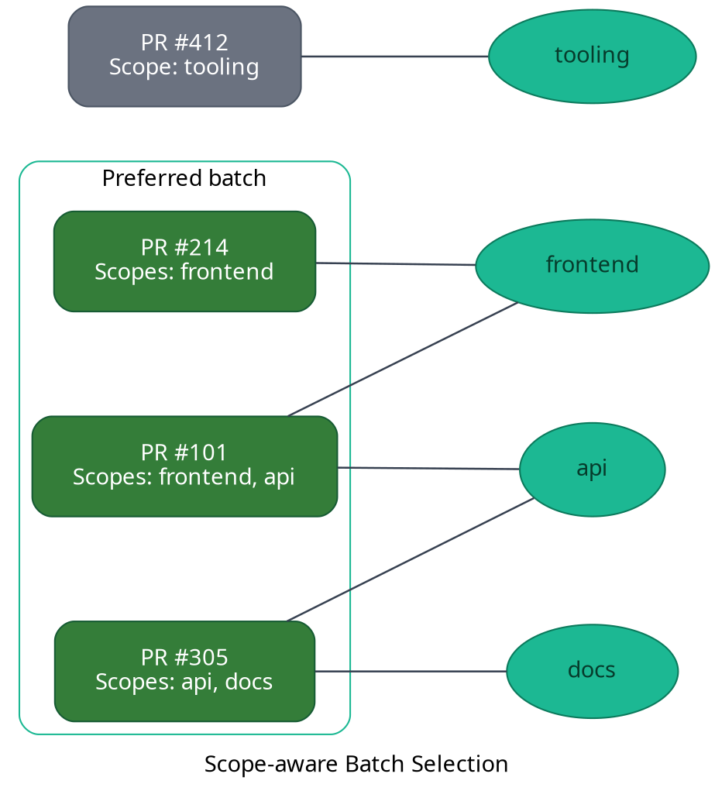

Mergify scopes describe the areas of your codebase that a pull request touches. By attaching scopes
to pull requests, the merge queue can build smarter batches, reuse the same CI work, and avoid
mixing unrelated changes.

## Scope-aware batching at a glance

When several pull requests are eligible for the next batch, Mergify compares their scopes and
prioritizes the combination that shares the most scopes in common. Pull requests that overlap in
scope are tested together first, while unrelated changes stay in the queue until a compatible batch
is available or Mergify needs them to fill the requested batch size.



In the example above, the queue selects the three pull requests that share the `frontend` and `api`
scopes first. The change that only touches the `tooling` scope is kept aside unless Mergify needs it
later to complete the batch.

## How Mergify builds scope-aware batches

Scope-aware batching follows these steps:

1. **Collect candidates:** Mergify looks at the next pull requests in queue order that pass the
   queue rules and are ready to batch.

2. **Score overlap:** It evaluates how many scopes each candidate shares with the already selected
   pull requests and prefers combinations with the highest overlap.

3. **Fill the batch:** If the required `batch_size` is not reached with strongly overlapping scopes,
   Mergify expands the selection to the best remaining options so the batch can
   still start.

4. **Fallback safely:** When no scope overlap exists, the queue still batches the oldest pull
   requests together to honor throughput, but these situations are the exception rather than the
   rule.

This strategy maximises CI reuse: tests that run for one pull request are likely valid for the other
changes in the batch because they touch the same areas of the codebase.

## Scope assignment lifecycle

Scopes can be attached to pull requests automatically or manually:

- **File pattern detection:** Define scopes directly in your configuration so Mergify infers them
  from changed paths once your CI uploads the results via
  [`gha-mergify-ci`](https://github.com/Mergifyio/gha-mergify-ci) or an equivalent integration.
  See [file-pattern scopes](/merge-queue/monorepo/file-patterns) for a
  step-by-step setup.

- **Manual upload:** Use the [`gha-mergify-ci`](https://github.com/Mergifyio/gha-mergify-ci)
  GitHub Action, the REST API, or the `mergify scopes-send` CLI to push scopes computed by your own
  tooling (Nx, Bazel, Turborepo, etc.). Examples are available in the build tool guides under
  [Monorepo integrations](/merge-queue/monorepo).

## Configuration schema

Declare scopes at the top level of your `.mergify.yml` file:

```yaml
scopes:
  source:
    files:
      frontend:
        includes:
          - apps/web/**/*
      api:
        includes:
          - services/api/**/*.py
      docs:
        includes:
          - docs/**/*
  merge_queue_scope: merge-queue

queue_rules:
  - name: default
    batch_size: 3
```

### Top-level keys

- `scopes.source`: selects how scopes are provided.
  - `files`: map scope names to the file patterns that define them. Each entry accepts `includes`
    and optional `excludes` lists.

  - `manual`: instructs Mergify to expect scopes from external systems via the API or GitHub
    Action.

  - `null`: disables scopes entirely.

- `scopes.merge_queue_scope`: optional name automatically applied to temporary merge queue pull
  requests (defaults to `merge-queue`). Set it to `null` to disable.

### Manual source example

```yaml
scopes:
  source:
    manual:

queue_rules:
  - name: default
    batch_size: 5
```

With the configuration above you must push scopes yourself—typically from a CI job that analyses the
pull request and calls `gha-mergify-ci` with the `scopes-upload` action. This is the recommended
approach when build systems such as Bazel, Nx, or Turborepo already know which projects are affected.

## Best practices

- Keep scope names stable and small in number so batches stay meaningful.

- Prefer scopes that align with your CI topology—if a test suite covers a specific service or
  package, create a scope with the same boundary.

- Still configure sane `batch_max_wait_time` values: scopes help Mergify pick the right pull
  requests, but you control how long it waits for an ideal batch.

- Monitor merge queue analytics to verify that scope-aware batching increases success rate and
  reduces redundant CI runs; adjust scope definitions when you see batches mixing unrelated changes.
