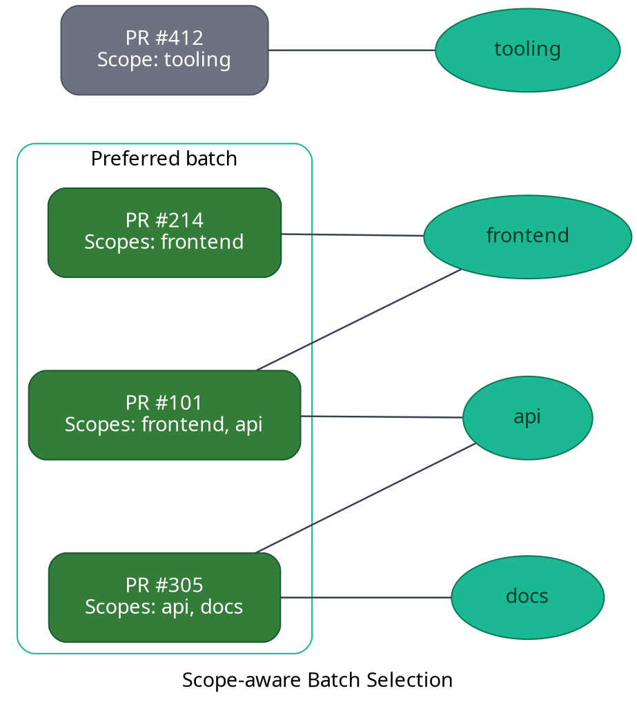

import Youtube from '../../../components/Youtube.astro'

Mergify scopes describe the areas of your codebase that a pull request touches. By attaching scopes
to pull requests, the merge queue can build smarter batches, reuse the same CI work, and avoid
mixing unrelated changes.

Looking to use scopes outside of the merge queue? Check out [Monorepo CI](/monorepo-ci) for
scope-driven CI workflows.

Here's a quick walkthrough of how we use scopes on Mergify's own monorepo:

<Youtube video="GOqDmZl6EI0" title="How Mergify scopes work in a monorepo" />

## Scope-aware batching at a glance

When several pull requests are eligible for the next batch, Mergify compares their scopes and
prioritizes the combination that shares the most scopes in common. Pull requests that overlap in
scope are tested together first, while unrelated changes stay in the queue until a compatible batch
is available or Mergify needs them to fill the requested batch size.


```dot class="graph"
strict digraph {
  fontname="sans-serif";
  rankdir="LR";
  label="Scope-aware Batch Selection";
  nodesep=0.9;
  ranksep=1.2;
  splines=polyline;

  edge [fontname="sans-serif", color="#374151", arrowhead=none, penwidth=1.2];

  subgraph cluster_preferred {
  style="rounded";
  color="#1CB893";
    label="Preferred batch";

    PR1 [shape=box, style="rounded,filled", fillcolor="#347D39", fontcolor="white", color="#165B33", margin="0.35,0.22", fontname="sans-serif", label="PR #101\nScopes: frontend, api"];
    PR2 [shape=box, style="rounded,filled", fillcolor="#347D39", fontcolor="white", color="#165B33", margin="0.35,0.22", fontname="sans-serif", label="PR #214\nScopes: frontend"];
    PR3 [shape=box, style="rounded,filled", fillcolor="#347D39", fontcolor="white", color="#165B33", margin="0.35,0.22", fontname="sans-serif", label="PR #305\nScopes: api, docs"];
  }

  PR4 [shape=box, style="rounded,filled", fillcolor="#6B7280", fontcolor="white", color="#4B5563", margin="0.35,0.22", fontname="sans-serif", label="PR #412\nScope: tooling"];

  frontend [shape=oval, style="filled", fillcolor="#1CB893", fontcolor="#063C2C", color="#0B7A5C", margin="0.3,0.18", fontname="sans-serif", label="frontend"];
  api [shape=oval, style="filled", fillcolor="#1CB893", fontcolor="#063C2C", color="#0B7A5C", margin="0.3,0.18", fontname="sans-serif", label="api"];
  docs [shape=oval, style="filled", fillcolor="#1CB893", fontcolor="#063C2C", color="#0B7A5C", margin="0.3,0.18", fontname="sans-serif", label="docs"];
  tooling [shape=oval, style="filled", fillcolor="#1CB893", fontcolor="#063C2C", color="#0B7A5C", margin="0.3,0.18", fontname="sans-serif", label="tooling"];

  PR1 -> frontend;
  PR1 -> api;
  PR2 -> frontend;
  PR3 -> api;
  PR3 -> docs;
  PR4 -> tooling;
}
```

In the example above, the queue selects the three pull requests that share the `frontend` and `api`
scopes first. The change that only touches the `tooling` scope is kept aside unless Mergify needs it
later to complete the batch.

## How Mergify builds scope-aware batches

Scope-aware batching follows these steps:

1. **Collect candidates:** Mergify looks at the next pull requests in queue order that pass the
   queue rules and are ready to batch.

2. **Score overlap:** It evaluates how many scopes each candidate shares with the already selected
   pull requests and prefers combinations with the highest overlap.

3. **Fill the batch:** If the required `batch_size` is not reached with strongly overlapping scopes,
   Mergify expands the selection to the best remaining options so the batch can
   still start.

4. **Fallback safely:** When no scope overlap exists, the queue still batches the oldest pull
   requests together to honor throughput, but these situations are the exception rather than the
   rule.

This strategy maximizes CI reuse: tests that run for one pull request are likely valid for the other
changes in the batch because they touch the same areas of the codebase.

## Scope assignment lifecycle

Scopes can be attached to pull requests automatically or manually:

- **File pattern detection:** Define scopes directly in your configuration and Mergify evaluates
  them itself, matching each pull request's changed files against your patterns. No CI job or GitHub
  Action is required for the queue to batch by scope. See
  [file-pattern scopes](/merge-queue/scopes/file-patterns) for a step-by-step setup.

- **Manual upload:** Use the [`gha-mergify-ci`](https://github.com/Mergifyio/gha-mergify-ci)
  GitHub Action, the [REST API](/api/pull-requests), or the `mergify ci scopes-send` CLI to push scopes
  computed by your own tooling (Nx, Bazel, Turborepo, etc.). Examples are available in the build
  tool guides under [Scopes integrations](/merge-queue/scopes).

## Configuration schema

Declare scopes at the top level of your `.mergify.yml` file:

```yaml
scopes:
  source:
    files:
      frontend:
        include:
          - apps/web/**/*
      api:
        include:
          - services/api/**/*.py
      docs:
        include:
          - docs/**/*
  merge_queue_scope: merge-queue

queue_rules:
  - name: default
    batch_size: 3
```

### Top-level keys

- `scopes.source`: selects how scopes are provided.
  - `files`: map scope names to the file patterns that define them. Each entry accepts `include`
    and optional `exclude` lists.

  - `manual`: instructs Mergify to expect scopes from external systems via the API or GitHub
    Action.

  - `null`: disables scopes entirely.

- `scopes.merge_queue_scope`: optional name automatically applied to temporary merge queue pull
  requests (defaults to `merge-queue`). Set it to `null` to disable.

- `scopes.capacities`: optional map of scope name to the number of speculative checks that scope may
  run at the same time, used to limit per-scope concurrency in parallel mode. See [Limiting
  concurrency per scope](/merge-queue/queue-modes#limiting-concurrency-per-scope).

- `scopes.barrier_files`: optional file filters marking files that impact every scope. Only valid
  with a `files` source. A pull request that changes a matching file becomes a merge queue barrier.
  See [Declaring a pull request impacts every scope](#declaring-a-pull-request-impacts-every-scope).

### Manual source example

```yaml
scopes:
  source:
    manual:

queue_rules:
  - name: default
    batch_size: 5
```

With the configuration above you must push scopes yourself—typically from a CI job that analyses the
pull request and calls `gha-mergify-ci` with the `scopes-upload` action. This is the recommended
approach when build systems such as Bazel, Nx, or Turborepo already know which projects are affected.

## Declaring a pull request impacts every scope

Some pull requests invalidate everything: a build-system configuration change or a shared
toolchain bump. Enumerating every scope by hand is brittle, and the list goes stale as soon as
your set of scopes changes.

Instead, mark the change as a **barrier**, a pull request that impacts every scope. Mergify sets an
`all_scopes` flag on it and [serializes the queue](#barrier-behavior-in-the-queue) around it. How
you set the flag depends on where your scopes come from:

- **File-pattern scopes:** declare `scopes.barrier_files` and Mergify sets the flag whenever a pull
  request changes a matching file.

- **Manual scopes:** set `all_scopes: true` when you upload scopes through the API or CLI.

### Barrier files (file-pattern scopes)

When your scopes come from [file patterns](/merge-queue/scopes/file-patterns), declare the files
that impact every scope under `scopes.barrier_files`. Whenever a queued pull request changes a
matching file, Mergify flags it with `all_scopes` and treats it as a barrier, with no CI job or
manual upload required.

```yaml
scopes:
  source:
    files:
      frontend:
        include:
          - apps/web/**/*
      api:
        include:
          - services/api/**/*.py
  barrier_files:
    include:
      - .github/workflows/**
      - Makefile

queue_rules:
  - name: default
    batch_size: 3
```

With this configuration, a pull request that changes `.github/workflows/**` or `Makefile` (files
that affect the whole repository) becomes a barrier, whichever scopes it also belongs to.

`barrier_files` accepts the same `include` and optional `exclude` patterns as a scope, with two
constraints:

- **At least one `include` pattern is required.** An empty or exclude-only filter would match every
  pull request and silently serialize the entire queue, so Mergify rejects it. The same rule lives
  in the JSON schema, so the dashboard and other config editors catch it too.

- **`barrier_files` only works with a `files` source.** A `manual` source reports the barrier
  through the API instead (see below), and a configuration with no source has no scopes to impact.
  Mergify rejects `barrier_files` in either case.

You can also manage these patterns from the dashboard: the **Barrier files** editor in the queue
configuration **Scopes** section edits the same `barrier_files` filters for file-pattern scopes.

### Marking a barrier on upload (manual scopes)

When you upload scopes yourself, set the `all_scopes` flag on the pull request. With the
[Mergify CLI](/cli/usage), pass `--all` to `scopes-send`:

```bash
mergify ci scopes-send -s build-system --all
```

When you upload a scopes JSON file with `--scopes-json`, the CLI also honors an
`"all_scopes": true` field in the file itself, so your detection tooling can set the flag without
touching the command line.

You can send the flag through the [REST API](/api/pull-requests) as well:

```bash
curl -X PUT \
     -H "Accept: application/json" \
     -H "Authorization: Bearer <my-application-api-key>" \
     -H "Content-Type: application/json" \
     -d '{"scopes": ["build-system"], "all_scopes": true}' \
     https://api.mergify.com/v1/repos/<owner>/<repository>/pulls/<number>/scopes
```

The flag complements the `scopes` list rather than replacing it: keep reporting the concrete
scopes your tooling detected, and set `all_scopes: true` on top when the change affects every
target.

### Barrier behavior in the queue

A pull request flagged with `all_scopes` conflicts with every scope, so the merge queue treats it
as a barrier:

- It is never batched with other pull requests and never runs its checks in parallel with other
  batches.

- Batches already running when it enters the queue complete first.

- Every pull request queued behind it waits for it to merge, including pull requests whose scopes
  first appear after the barrier entered the queue.

- With [per-scope capacities](/merge-queue/queue-modes#limiting-concurrency-per-scope), the
  barrier consumes one slot in every capped scope.

The queue serializes at the barrier and resumes normal scope-aware batching once the flagged pull
request merges. Because a barrier defeats batching and parallelism, reserve `all_scopes` for
changes that genuinely require testing against everything.

The flag is visible in the [merge queue status API](/api/merge-queue) and on the draft pull request
description created by the queue.

## Best practices

- Keep scope names stable and small in number so batches stay meaningful.

- Prefer scopes that align with your CI topology—if a test suite covers a specific service or
  package, create a scope with the same boundary.

- Still configure sane `batch_max_wait_time` values: scopes help Mergify pick the right pull
  requests, but you control how long it waits for an ideal batch.

- Monitor merge queue analytics to verify that scope-aware batching increases success rate and
  reduces redundant CI runs; adjust scope definitions when you see batches mixing unrelated changes.
