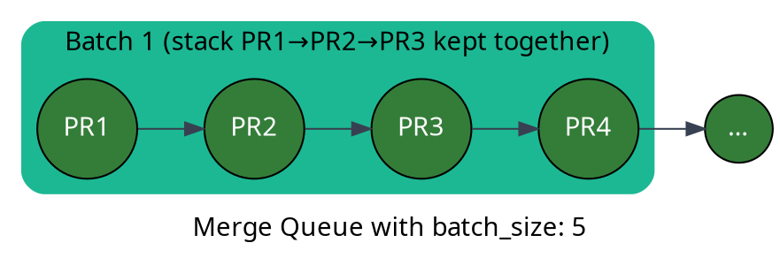
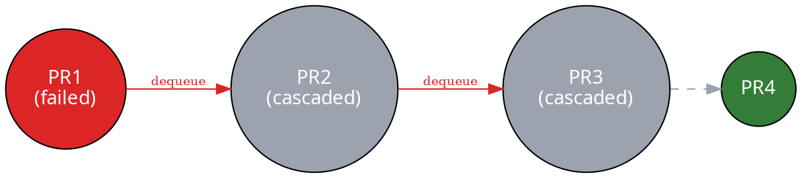

import GitGraph from '~/components/GitGraph.astro';

The Merge Queue understands [Stacks](/stacks) natively. When you queue a stacked
pull request, the queue treats the whole chain as a unit: it propagates the
queue command up the stack, keeps stacked PRs together when batching, and
cascades failures so the rest of the stack stops cleanly when something
breaks.

## How a Stack Is Detected

The queue recognizes a stack only when **both** signals hold at every step:

- The PRs are physically chained: each PR's base branch is the previous PR's
  head branch.

- Each PR carries a `Depends-On: #N` marker in its body, declaring its
  dependency on the previous PR.

This is exactly what [`mergify stack push`](/stacks/creating) produces. PRs
chained only by branch refs (for example, GitFlow promotion chains like
`dev` → `staging` → `prod`) are **not** treated as a stack. Without the
`Depends-On:` marker, the queue keeps each PR's literal base ref and queues
them independently.

<GitGraph
  commits={["A", "B", "C"]}
  commitColor="green"
  prs={[
    { label: "PR #1", commits: 0, annotation: "base: main" },
    { label: "PR #2", commits: 1, annotation: "base: PR #1" },
    { label: "PR #3", commits: 2, annotation: "base: PR #2" },
  ]}
/>

## Queueing a Whole Stack at Once

Run [`@mergifyio queue`](/commands/queue) on the **top** PR of a stack and the
queue command propagates synthetically to every predecessor. The whole stack
enters the queue from a single comment. You don't need to comment on each
PR.

For a stack `PR1 → PR2 → PR3`, commenting `@mergifyio queue` on PR3 enqueues
PR1, PR2, and PR3 in the right order. While PR3 waits for its predecessors to
join the queue, its checks display the condition
`stack-predecessor-queued` as pending. That's the queue holding PR3 back
until PR1 and PR2 are queued ahead of it.

:::tip
  This works the same with [Auto-Merge](/merge-protections/auto-merge):
  approve the top PR with Auto-Merge enabled and the entire stack flows into
  the queue as soon as `queue_conditions` are met.
:::

## Stack-Aware Base

Every stacked PR is queued against the **stack root** (e.g. `main`), not its
immediate parent branch. Without this, PR2 would be queued against PR1's head
branch and could never reach `main`, so the queue would have nothing to merge
into.

```dot class="graph" style="max-width: 320px; height: auto; display: block; margin: 1.5em auto"
strict digraph {
    fontname="sans-serif";
    fontsize=10;
    rankdir="LR";
    nodesep=0.2;
    ranksep=0.4;

    node [style=filled, fontname="sans-serif", fontcolor="white", fontsize=10, shape=circle, width=0.45, height=0.45, fixedsize=true];
    edge [fontname="sans-serif", fontsize=9, color="#5B21B6", fontcolor="#5B21B6"];

    PR1 [fillcolor="#347D39"];
    PR2 [fillcolor="#347D39"];
    PR3 [fillcolor="#347D39"];
    main [label="main", shape=rectangle, fillcolor="#111827", width=0.7, height=0.4, fixedsize=false];

    PR1 -> main;
    PR2 -> main;
    PR3 -> main;
}
```

You don't configure this. It's automatic for any PR detected as part of a
stack.

## Stack-Aware Batching

The queue treats a stack as an ordered chain when assembling
[batches](/merge-queue/batches). Two guarantees hold:

- **Same scope group.** With [scopes](/merge-queue/scopes) enabled, stacked
  PRs are consolidated into the scope group of the bottom PR, even if their
  individual scopes differ. The stack always travels through the same CI lane
  rather than getting split across unrelated lanes.

- **Bottom-up order.** Within that group, predecessors always queue ahead of
  successors. PR3 is never validated before PR1 and PR2.

In sequential batching, the queue actively packs a stack into the same batch
when its predecessors still fit in the remaining capacity. In parallel
checks, a stack longer than `batch_size` (or a stack sharing its scope group
with higher-priority unrelated PRs) lands across consecutive batches. Order
is preserved either way.



A PR only joins a batch if it and its still-waiting predecessors fit inside
the remaining capacity. When the stack is larger than `batch_size`, it lands
across consecutive batches bottom-first: the first batch validates the deepest
PRs that fit, and once they merge they drop out of the predecessor set, so the
next batch picks up where the previous one stopped.

## Cascade Dequeue

If any PR in a queued stack fails validation or is dequeued, every successor
still in the queue is dequeued automatically with the reason
`StackPredecessorDequeued`. This stops the queue from validating PRs whose
dependency just broke. There's no point checking PR3 if PR1 just failed.



After fixing the broken PR, re-queue the stack from the top with
`@mergifyio queue`. Propagation re-enqueues the predecessors as needed.

:::note
  Cascade dequeue only affects PRs that are still **queued**. PRs that already
  merged successfully (lower in the stack) are untouched.
:::

## Limits

- **Maximum stack depth: 20.** Stacks deeper than 20 PRs aren't recognized as
  a stack by the queue and fall back to per-PR queueing.

- **Drafts break the stack.** A draft predecessor blocks queue propagation:
  the queue won't pull a stack through a PR still marked as draft. Mark the
  PR ready for review first.

## Related

- [Stacks](/stacks): create and update stacks with `mergify stack push`.

- [`@mergifyio queue`](/commands/queue): the command that triggers stack
  propagation.

- [Batches](/merge-queue/batches): batch-size and CI-cost trade-offs.

- [Scopes](/merge-queue/scopes): how stacks interact with monorepo scopes.
