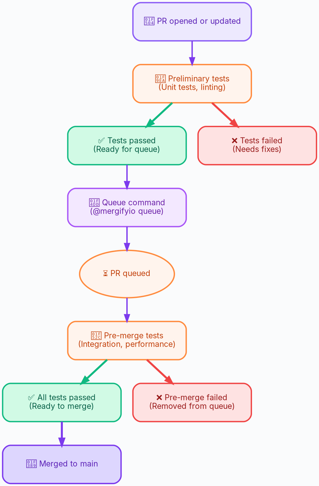

import Youtube from '../../../components/Youtube.astro'

Split your CI into fast preliminary checks on every PR and full tests that run only before merging.

:::tip
  Understand the concepts behind two-step CI at the
  [Merge Queue Academy](https://merge-queue.academy/features/two-step-ci/).
:::

<Youtube video="2mVymDFMaMk" title="Using two-step CI"/>

## The Two Phases

**Step 1: Preliminary tests** run on every PR push: linters, formatters,
unit tests, basic compile checks. Fast feedback, cheap to run.

**Step 2: Pre-merge tests** run only when a PR enters the merge queue:
integration tests, end-to-end tests, performance benchmarks. Thorough but
expensive.

## How It Works


```dot class="graph"
strict digraph {
    fontname="Inter, system-ui, sans-serif";
    rankdir="TB";
    bgcolor="#FAFBFC";

    // Global node and edge styling
    node [
        style="filled,rounded",
        shape=rect,
        fontcolor="black",
        fontname="Inter, system-ui, sans-serif",
        fontsize=12,
        margin=0.2,
        penwidth=2,
        width=2.5,
        height=0.8
    ];

    edge [
        color="#7C3AED",
        arrowhead=normal,
        fontname="Inter, system-ui, sans-serif",
        fontsize=10,
        penwidth=2
    ];

    // Start state
    open [
        label="🔄 PR opened or updated",
        fillcolor="#EDE9FE",
        color="#8B5CF6",
        fontcolor="#5B21B6"
    ];

    // Preliminary tests phase
    preliminary [
        label="🧪 Preliminary tests\n(Unit tests, linting)",
        fillcolor="#FFF4ED",
        color="#FF8A3D",
        fontcolor="#C2410C"
    ]

    // Success/failure branches for preliminary tests
    subgraph cluster_preliminary_results {
        style="invis";
        preliminary_ok [
            label="✅ Tests passed\n(Ready for queue)",
            fillcolor="#D1FAE5",
            color="#10B981",
            fontcolor="#065F46"
        ]

        preliminary_fail [
            label="❌ Tests failed\n(Needs fixes)",
            fillcolor="#FEE2E2",
            color="#EF4444",
            fontcolor="#991B1B"
        ]
    }

    // Queue action
    queue_req [
        label="📝 Queue command\n(@mergifyio queue)",
        fillcolor="#F3E8FF",
        color="#A855F7",
        fontcolor="#6B21A8"
    ]

    // Queue state
    queued [
        label="⏳ PR queued",
        shape=ellipse,
        fillcolor="#FFF4ED",
        color="#FF8A3D",
        fontcolor="#C2410C",
        width=2,
        height=1
    ];

    // Pre-merge tests phase
    premerge [
        label="🔬 Pre-merge tests\n(Integration, performance)",
        fillcolor="#FFF4ED",
        color="#FF8A3D",
        fontcolor="#C2410C"
    ]

    // Success/failure branches for pre-merge tests
    subgraph cluster_premerge_results {
        style="invis";
        premerge_ok [
            label="✅ All tests passed\n(Ready to merge)",
            fillcolor="#D1FAE5",
            color="#10B981",
            fontcolor="#065F46"
        ]

        premerge_fail [
            label="❌ Pre-merge failed\n(Removed from queue)",
            fillcolor="#FEE2E2",
            color="#EF4444",
            fontcolor="#991B1B"
        ]
    }

    // Final merge
    merged [
        label="🎉 Merged to main",
        fillcolor="#DDD6FE",
        color="#7C3AED",
        fontcolor="#5B21B6"
    ]

    // Flow connections - main path
    open -> preliminary;
    preliminary -> preliminary_ok [color="#10B981", penwidth=3];
    preliminary -> preliminary_fail [color="#EF4444", penwidth=3];
    preliminary_ok -> queue_req;
    queue_req -> queued;
    queued -> premerge;
    premerge -> premerge_ok [color="#10B981", penwidth=3];
    premerge -> premerge_fail [color="#EF4444", penwidth=3];
    premerge_ok -> merged [color="#7C3AED", penwidth=3];

    // Rank constraints for better layout
    {rank=same; preliminary_ok, preliminary_fail}
    {rank=same; premerge_ok, premerge_fail}
}
```

## Batch Processing

Enable [batching](/merge-queue/batches) to run pre-merge tests **once** for a
group of PRs instead of per PR. For 5 PRs with a 30-minute pre-merge suite,
that's 30 minutes instead of 2.5 hours.

## Configuration

### CI System

Run pre-merge tests only on merge queue branches. Mergify creates branches
prefixed with `mergify/merge-queue/` (customizable via `queue_branch_prefix`
in [`queue_rules`](/configuration/file-format/#queue-rules)).

#### GitHub Actions

```yaml
name: CI

on:
  pull_request:
    branches:
      - main

jobs:
  # STEP 1: Preliminary tests (runs on every PR)
  preliminary-tests:
    runs-on: ubuntu-latest
    steps:
    - uses: actions/checkout@v4
    - name: Run linters
      run: make lint
    - name: Run unit tests
      run: make test-unit

  # STEP 2: Pre-merge tests (runs only on merge queue branches)
  pre-merge-tests:
    if: startsWith(github.head_ref, 'mergify/merge-queue/')
    runs-on: ubuntu-latest
    steps:
    - uses: actions/checkout@v4
    - name: Run integration tests
      run: make test-integration
    - name: Run E2E tests
      run: make test-e2e
    - name: Run performance benchmarks
      run: make benchmark
```

#### Other CI Systems

- **CircleCI**: Branch filter regex `/^mergify\/merge-queue\/.*/`
- **Jenkins**: Conditional execution on `BRANCH_NAME`
- **GitLab CI**: `only: /^mergify\/merge-queue\/.*/`

### Mergify

```yaml
queue_rules:
  - name: default
    # PRs can enter the queue after preliminary tests pass
    queue_conditions:
      - check-success=preliminary-tests

    # PRs can merge only after pre-merge tests pass
    merge_conditions:
      - check-success=pre-merge-tests
```

`queue_conditions` gates entry into the queue; `merge_conditions` gates the
final merge to main.
