As your codebase grows, so does your test suite. What once took minutes can
balloon into hour-long CI runs that slow down development and drain resources.
But here's the insight: not all tests need to run at every stage of the PR
lifecycle.

Two-step CI is a strategy that separates your test suite into two phases—fast
preliminary checks that run on every commit, and comprehensive validation that
runs only before merging. Combined with Mergify's merge queue, this approach
can dramatically reduce CI time and costs while maintaining code quality.

## Implementing Two-Step CI

A two-step CI approach separates tests into two phases based on when they need
to run and what they validate:

### Step 1: Preliminary Tests (Fast Feedback)
Run immediately when a PR is opened or updated. These are:
- **Fast**: Complete in minutes, not hours
- **Essential**: Code quality checks that catch obvious issues

Examples: Linters, formatters, unit tests, basic compile checks

These give developers rapid feedback and prevent broken code from entering the
merge queue.

### Step 2: Pre-Merge Tests (Comprehensive Validation)

Run only when a PR enters the merge queue, just before merging. These are:

- **Thorough**: Full test coverage including edge cases
- **Expensive**: Integration tests, end-to-end tests, performance benchmarks
- **Slower**: May take 30+ minutes to complete

These jobs ensure code quality before merging to your main branch, without
slowing down every PR update.

## How It Works

```dot class="graph"
strict digraph {
    fontname="Inter, system-ui, sans-serif";
    rankdir="TB";
    bgcolor="#FAFBFC";

    // Global node and edge styling
    node [
        style="filled,rounded",
        shape=rect,
        fontcolor="black",
        fontname="Inter, system-ui, sans-serif",
        fontsize=12,
        margin=0.2,
        penwidth=2,
        width=2.5,
        height=0.8
    ];

    edge [
        color="#7C3AED",
        arrowhead=normal,
        fontname="Inter, system-ui, sans-serif",
        fontsize=10,
        penwidth=2
    ];

    // Start state
    open [
        label="🔄 PR opened or updated",
        fillcolor="#EDE9FE",
        color="#8B5CF6",
        fontcolor="#5B21B6"
    ];

    // Preliminary tests phase
    preliminary [
        label="🧪 Preliminary tests\n(Unit tests, linting)",
        fillcolor="#FFF4ED",
        color="#FF8A3D",
        fontcolor="#C2410C"
    ]

    // Success/failure branches for preliminary tests
    subgraph cluster_preliminary_results {
        style="invis";
        preliminary_ok [
            label="✅ Tests passed\n(Ready for queue)",
            fillcolor="#D1FAE5",
            color="#10B981",
            fontcolor="#065F46"
        ]

        preliminary_fail [
            label="❌ Tests failed\n(Needs fixes)",
            fillcolor="#FEE2E2",
            color="#EF4444",
            fontcolor="#991B1B"
        ]
    }

    // Queue action
    queue_req [
        label="📝 Queue command\n(@mergifyio queue)",
        fillcolor="#F3E8FF",
        color="#A855F7",
        fontcolor="#6B21A8"
    ]

    // Queue state
    queued [
        label="⏳ PR queued",
        shape=ellipse,
        fillcolor="#FFF4ED",
        color="#FF8A3D",
        fontcolor="#C2410C",
        width=2,
        height=1
    ];

    // Pre-merge tests phase
    premerge [
        label="🔬 Pre-merge tests\n(Integration, performance)",
        fillcolor="#FFF4ED",
        color="#FF8A3D",
        fontcolor="#C2410C"
    ]

    // Success/failure branches for pre-merge tests
    subgraph cluster_premerge_results {
        style="invis";
        premerge_ok [
            label="✅ All tests passed\n(Ready to merge)",
            fillcolor="#D1FAE5",
            color="#10B981",
            fontcolor="#065F46"
        ]

        premerge_fail [
            label="❌ Pre-merge failed\n(Removed from queue)",
            fillcolor="#FEE2E2",
            color="#EF4444",
            fontcolor="#991B1B"
        ]
    }

    // Final merge
    merged [
        label="🎉 Merged to main",
        fillcolor="#DDD6FE",
        color="#7C3AED",
        fontcolor="#5B21B6"
    ]

    // Flow connections - main path
    open -> preliminary;
    preliminary -> preliminary_ok [color="#10B981", penwidth=3];
    preliminary -> preliminary_fail [color="#EF4444", penwidth=3];
    preliminary_ok -> queue_req;
    queue_req -> queued;
    queued -> premerge;
    premerge -> premerge_ok [color="#10B981", penwidth=3];
    premerge -> premerge_fail [color="#EF4444", penwidth=3];
    premerge_ok -> merged [color="#7C3AED", penwidth=3];

    // Rank constraints for better layout
    {rank=same; preliminary_ok, preliminary_fail}
    {rank=same; premerge_ok, premerge_fail}
}
```



## Batch Processing: Even More Efficient

When you enable [batching](/merge-queue/batches) in Mergify's merge queue, you
can achieve even greater efficiency. Instead of running pre-merge tests
separately for each PR, Mergify:

1. Groups multiple PRs together in a batch
2. Runs the expensive pre-merge tests **once** for the entire batch
3. Merges all PRs if the batch passes

**Example**: If you have 5 PRs ready to merge and your pre-merge tests take 30
minutes:
- **Without batching**: 5 × 30 minutes = 2.5 hours of CI time
- **With batching**: 1 × 30 minutes = 30 minutes of CI time

That's **80% reduction** in CI resource usage!

```dot class="graph"
strict digraph {
    fontname="Inter, system-ui, sans-serif";
    rankdir="TB";
    bgcolor="#FAFBFC";

    // Global styling
    node [
        style="filled,rounded",
        shape=rect,
        fontcolor="black",
        fontname="Inter, system-ui, sans-serif",
        fontsize=10,
        margin=0.12,
        penwidth=2,
        width=1.8,
        height=0.6
    ];

    edge [
        color="#7C3AED",
        arrowhead=normal,
        fontname="Inter, system-ui, sans-serif",
        fontsize=9,
        penwidth=2
    ];

    // Subgraph for PR #1 flow
    subgraph cluster_pr1 {
        style="rounded,filled";
        fillcolor="#FAF5FF";
        color="#A855F7";
        penwidth=1;
        label="PR #1 Workflow";
        fontname="Inter, system-ui, sans-serif";
        fontsize=10;
        fontcolor="#7C3AED";

        open1 [
            label="🔄 PR #1 opened",
            fillcolor="#EDE9FE",
            color="#8B5CF6",
            fontcolor="#5B21B6"
        ];

        preliminary1 [
            label="🧪 Tests",
            fillcolor="#FFF4ED",
            color="#FF8A3D",
            fontcolor="#C2410C"
        ];

        preliminary_ok1 [
            label="✅ Passed",
            fillcolor="#D1FAE5",
            color="#10B981",
            fontcolor="#065F46"
        ];

        queue_req1 [
            label="📝 Queue",
            fillcolor="#F3E8FF",
            color="#A855F7",
            fontcolor="#6B21A8"
        ];
    }

    // Subgraph for PR #2 flow
    subgraph cluster_pr2 {
        style="rounded,filled";
        fillcolor="#FAF5FF";
        color="#A855F7";
        penwidth=1;
        label="PR #2 Workflow";
        fontname="Inter, system-ui, sans-serif";
        fontsize=10;
        fontcolor="#7C3AED";

        open2 [
            label="🔄 PR #2 opened",
            fillcolor="#EDE9FE",
            color="#8B5CF6",
            fontcolor="#5B21B6"
        ];

        preliminary2 [
            label="🧪 Tests",
            fillcolor="#FFF4ED",
            color="#FF8A3D",
            fontcolor="#C2410C"
        ];

        preliminary_ok2 [
            label="✅ Passed",
            fillcolor="#D1FAE5",
            color="#10B981",
            fontcolor="#065F46"
        ];

        queue_req2 [
            label="📝 Queue",
            fillcolor="#F3E8FF",
            color="#A855F7",
            fontcolor="#6B21A8"
        ];
    }

    // Shared batch processing
    subgraph cluster_batch {
        style="rounded,filled";
        fillcolor="#FFF7ED";
        color="#FF8A3D";
        penwidth=2;
        label="";
        fontname="Inter, system-ui, sans-serif";
        fontsize=10;
        fontcolor="#C2410C";

        batch_title [
            label="📦 Batch Processing\n(Resource Efficient)",
            fillcolor="#FFEDD5",
            color="#FF8A3D",
            fontcolor="#9A3412",
            shape=note,
            width=2.2,
            height=0.6
        ];

        queued [
            label="⏳ Both PRs\nqueued together",
            shape=ellipse,
            fillcolor="#FFEDD5",
            color="#FF8A3D",
            fontcolor="#9A3412",
            width=2,
            height=0.8
        ];

        premerge [
            label="🔬 Single test run\n(Both PRs tested)",
            fillcolor="#FFF4ED",
            color="#FF8A3D",
            fontcolor="#C2410C",
            width=2.2
        ];

        premerge_ok [
            label="✅ Batch passed",
            fillcolor="#D1FAE5",
            color="#10B981",
            fontcolor="#065F46"
        ];

        // Internal layout
        batch_title -> queued [style=invis];
    }

    // Final merge results
    merged1 [
        label="🎉 PR #1 merged",
        fillcolor="#DDD6FE",
        color="#7C3AED",
        fontcolor="#5B21B6"
    ];

    merged2 [
        label="🎉 PR #2 merged",
        fillcolor="#DDD6FE",
        color="#7C3AED",
        fontcolor="#5B21B6"
    ];

    // PR #1 flow
    open1 -> preliminary1;
    preliminary1 -> preliminary_ok1 [color="#10B981", penwidth=3];
    preliminary_ok1 -> queue_req1;
    queue_req1 -> queued;

    // PR #2 flow
    open2 -> preliminary2;
    preliminary2 -> preliminary_ok2 [color="#10B981", penwidth=3];
    preliminary_ok2 -> queue_req2;
    queue_req2 -> queued;

    // Batch processing
    queued -> premerge;
    premerge -> premerge_ok [color="#10B981", penwidth=3];

    // Both PRs merge from single test success
    premerge_ok -> merged1 [color="#7C3AED", penwidth=3];
    premerge_ok -> merged2 [color="#7C3AED", penwidth=3];

    // Alignment
    {rank=same; merged1, merged2}
}
```



## Implementation Guide

Implementing two-step CI requires coordinating your CI system with Mergify's
merge queue. Here's how:

### Overview

1. **Configure CI to distinguish test phases**: Set up your CI to run
   preliminary tests on all branches, but pre-merge tests only on merge queue
   branches

2. **Configure Mergify conditions**: Define which tests must pass to enter the
   queue vs. which must pass to merge

### Step 1: Configure Your CI System

The key is to run pre-merge tests **only on merge queue branches**. By default,
Mergify creates branches prefixed with `mergify/merge-queue/` for queued PRs
(customizable via `queue_branch_prefix` in
[`queue_rules`](/configuration/file-format/#queue-rules)).

**Pattern**:
- ✅ Preliminary tests: Run on **all** branches
- ✅ Pre-merge tests: Run **only** on branches matching `mergify/merge-queue/*`

#### Example: GitHub Actions

```yaml
name: CI

on:
  pull_request:
    branches:
      - main

jobs:
  # STEP 1: Preliminary tests (runs on every PR)
  preliminary-tests:
    runs-on: ubuntu-latest
    steps:
    - uses: actions/checkout@v4
    - name: Run linters
      run: make lint
    - name: Run unit tests
      run: make test-unit

  # STEP 2: Pre-merge tests (runs only on merge queue branches)
  pre-merge-tests:
    if: startsWith(github.head_ref, 'mergify/merge-queue/')
    runs-on: ubuntu-latest
    steps:
    - uses: actions/checkout@v4
    - name: Run integration tests
      run: make test-integration
    - name: Run E2E tests
      run: make test-e2e
    - name: Run performance benchmarks
      run: make benchmark
```

How it works:

- `preliminary-tests` runs on **every PR** (fast feedback)

- `pre-merge-tests` runs **only when** the branch name starts with
  `mergify/merge-queue/` (comprehensive validation before merge)

#### Example: Other CI Systems

The same principle applies to any CI system. Just configure the pre-merge job
to run only on merge queue branches:

- **CircleCI**: Use branch filters with regex `/^mergify\/merge-queue\/.*/`
- **Jenkins**: Add conditional execution based on `BRANCH_NAME`
- **GitLab CI**: Use `only: /^mergify\/merge-queue\/.*/`

### Step 2: Configure Mergify

Set up your `queue_rules` to define when PRs can enter the queue and when they
can merge:

```yaml
queue_rules:
  - name: default
    # PRs can enter the queue after preliminary tests pass
    queue_conditions:
      - check-success=preliminary-tests

    # PRs can merge only after pre-merge tests pass
    merge_conditions:
      - check-success=pre-merge-tests
```

What this means:
- `queue_conditions`: Preliminary tests must pass before a PR can enter the
   merge queue

- `merge_conditions`: Pre-merge tests must pass before the PR actually merges
  to main (including `queue_conditions`)
