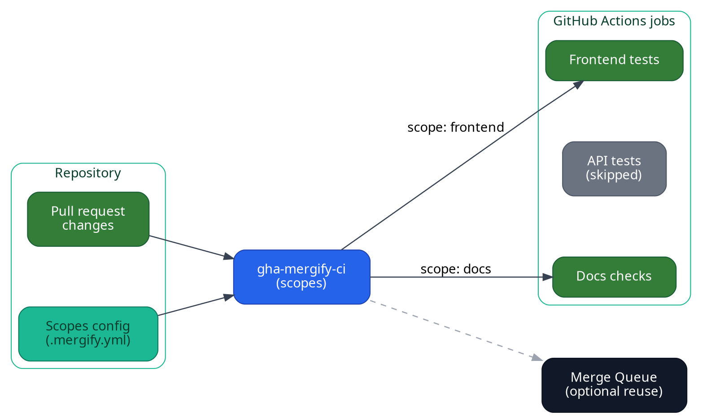

Monorepos supercharge collaboration, but they also make continuous integration
expensive. Every change potentially touches hundreds of packages or services,
and running the full test matrix for all of them at every pull request update
quickly becomes unsustainable.

Mergify Monorepo CI brings precision testing to your existing CI pipelines by
tagging each pull request with **scopes**. Scopes are named slices of your
repository that describe a service, package, or set of files (see
[Merge Queue Scopes](/merge-queue/scopes) for the full specification). A scope acts as
the contract between your codebase and your CI: if a pull request touches files
that belong to the `frontend` scope, every workflow that cares about that scope
knows it has work to do.

With scopes in place you can:

- Detect which projects or services are really impacted by a change.
- Run only the CI jobs that matter for those scopes.
- Reuse those scopes later in the merge queue to build smarter batches.

Today, GitHub Actions is the first CI platform with native support through our
[`gha-mergify-ci`](https://github.com/Mergifyio/gha-mergify-ci) action.

## How it works

1. **Define scopes** in your `.mergify.yml` file by mapping the areas of your repository (via file
   patterns) to scope names that matter for your CI.
   
2. **Collect scopes in CI.** A helper (currently
   [`gha-mergify-ci`](https://github.com/Mergifyio/gha-mergify-ci)) inspects the
   pull request diff and dispatches only the jobs whose scopes are touched.

3. **Drive your jobs conditionally.** Use the reported scopes to decide which
   workflows, test suites, or deployment steps should run for the current pull
   request.

4. **(Optional) Share scopes with Merge Queue.** The very same scopes help the merge queue build
   batches that group related pull requests, reuse your CI runs, and unlock advanced strategies like
   [batch merging](/merge-queue/batches) or [two-step CI](/merge-queue/two-step).

## What you can do with Monorepo CI

- Gate language-specific test suites with fine-grained scope checks.
- Trigger targeted build pipelines for individual services or packages.
- Run nightly or specialized workflows only when relevant scopes change.

## Get started

Define your scopes first so every workflow speaks the same language:

1. List the services, packages, or domains that deserve their own scope.

2. Map each scope to file patterns inside the
   [`scopes`](/merge-queue/scopes#configuration) block of your `.mergify.yml`
   file.

3. Commit the configuration and open a pull request to verify that the reported
   scopes match your expectations.

Once those scopes exist, pick the workflow that matches your setup:

- [GitHub Actions setup](/monorepo-ci/github-actions)
- [Monorepo integrations for merge queue](/merge-queue/monorepo)

Looking for a different CI provider? [Let us know](mailto:support@mergify.com); more platforms are on our roadmap.
