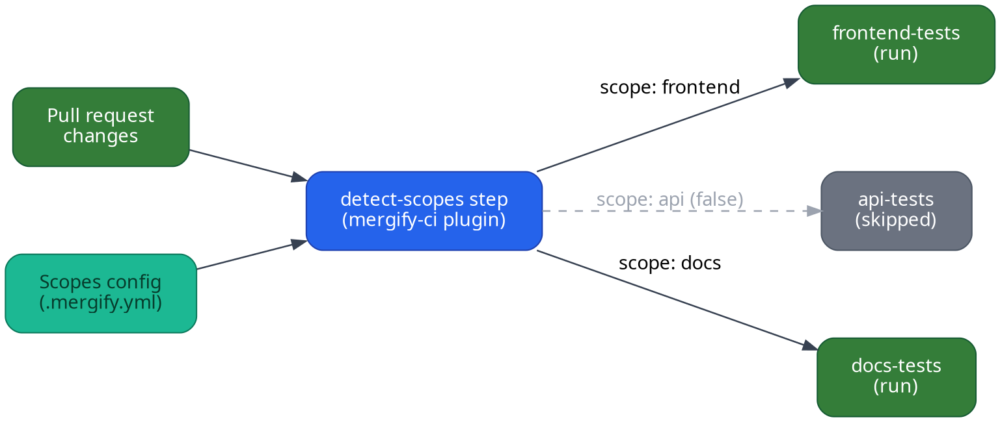

Mergify's Buildkite integration makes scopes actionable in your CI. This
guide shows how to wire scopes into your pipelines so that each pull request
runs only the jobs it truly needs.

## Prerequisites

Before you start, make sure you have:

- [`jq`](https://jqlang.github.io/jq/) installed on your Buildkite agents (used
  by the dynamic pipeline script to parse scope results)

- Scopes declared in your `.mergify.yml` so the plugin knows which areas of the
  repo map to each scope name:

```yaml
scopes:
  source:
    files:
      frontend:
        include:
          - apps/web/**/*
      api:
        include:
          - services/api/**/*
      docs:
        include:
          - docs/**/*
```

## Pipeline outline

A typical Buildkite pipeline with scopes consists of two parts:

1. **Detect scopes** using the
   [`mergifyio/mergify-ci`](https://github.com/Mergifyio/mergify-ci-buildkite-plugin) plugin.

2. **Use a dynamic pipeline** to conditionally upload only the steps that match
   the affected scopes.



## Example pipeline

### Static pipeline entry point

```yaml
# .buildkite/pipeline.yml
steps:
  - label: ":mag: Detect scopes"
    key: detect-scopes
    plugins:
      - mergifyio/mergify-ci#v1:
          action: scopes
          token: "${MERGIFY_TOKEN}"

  - label: ":pipeline: Upload conditional steps"
    depends_on: detect-scopes
    command: .buildkite/dynamic-pipeline.sh | buildkite-agent pipeline upload
```

### Dynamic pipeline script

```bash
#!/bin/bash
# .buildkite/dynamic-pipeline.sh
set -euo pipefail

SCOPES=$(buildkite-agent meta-data get "mergify-ci.scopes")

echo "steps:"

if echo "$SCOPES" | jq -e '.frontend == "true"' > /dev/null 2>&1; then
  cat <<'YAML'
  - label: ":react: Frontend tests"
    command: npm test
    plugins:
      - mergifyio/mergify-ci#v1:
          action: junit-process
          report_path: "junit.xml"
          token: "${MERGIFY_TOKEN}"
YAML
fi

if echo "$SCOPES" | jq -e '.api == "true"' > /dev/null 2>&1; then
  cat <<'YAML'
  - label: ":gear: API tests"
    command: pytest tests/api/
    plugins:
      - mergifyio/mergify-ci#v1:
          action: junit-process
          report_path: "reports/*.xml"
          token: "${MERGIFY_TOKEN}"
YAML
fi

if echo "$SCOPES" | jq -e '.docs == "true"' > /dev/null 2>&1; then
  cat <<'YAML'
  - label: ":books: Docs build"
    command: make docs
YAML
fi
```

Make the script executable:

```bash
chmod +x .buildkite/dynamic-pipeline.sh
```

### How it works

- The `detect-scopes` step calls the Mergify CI plugin with the `scopes`
  action, which inspects the pull request diff and stores a JSON map of scopes
  (`"true"` or `"false"`) as Buildkite meta-data under the key
  `mergify-ci.scopes`.

- The dynamic pipeline script reads the scopes meta-data and only emits the
  steps for scopes that are `"true"`, so unaffected jobs are skipped entirely.

- Each test step can optionally use the `junit-process` action to upload test
  results to CI Insights.

## Alternative: trigger pipelines

If your monorepo jobs live in separate Buildkite pipelines, you can use
`buildkite-agent pipeline upload` with trigger steps instead:

```bash
#!/bin/bash
# .buildkite/dynamic-pipeline.sh
set -euo pipefail

SCOPES=$(buildkite-agent meta-data get "mergify-ci.scopes")

echo "steps:"

if echo "$SCOPES" | jq -e '.frontend == "true"' > /dev/null 2>&1; then
  cat <<'YAML'
  - trigger: "frontend-pipeline"
    label: ":react: Trigger frontend pipeline"
    build:
      branch: "${BUILDKITE_BRANCH}"
      commit: "${BUILDKITE_COMMIT}"
YAML
fi

if echo "$SCOPES" | jq -e '.api == "true"' > /dev/null 2>&1; then
  cat <<'YAML'
  - trigger: "api-pipeline"
    label: ":gear: Trigger API pipeline"
    build:
      branch: "${BUILDKITE_BRANCH}"
      commit: "${BUILDKITE_COMMIT}"
YAML
fi
```

## Merge Queue integration

To reuse the same scopes for merge queue batching, see [Merge Queue
Scopes](/merge-queue/scopes).
