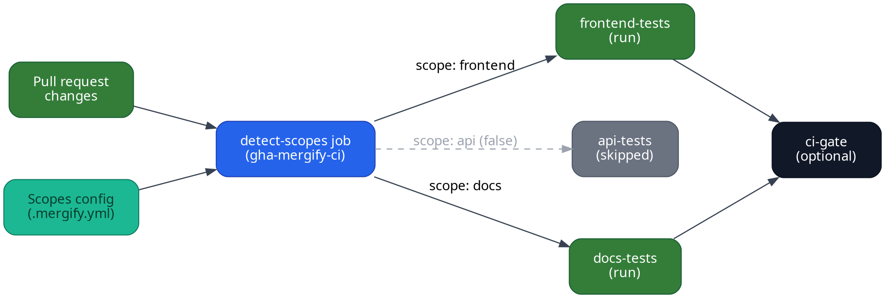

import { Image } from "astro:assets"
import ghaSummaryScreenshot from "../../images/monorepo-ci/github-actions/summary.png"

Mergify's GitHub Actions integration makes scopes actionable in your CI. This
guide shows how to wire scopes into your workflows so that each pull request
runs only the jobs it truly needs.

## Prerequisites

Before you start, declare scopes in your `.mergify.yml` so the action knows
which areas of the repo map to each scope name:

```yaml
scopes:
  source:
    files:
      frontend:
        include:
          - apps/web/**/*
      api:
        include:
          - services/api/**/*
      docs:
        include:
          - docs/**/*
```

## Workflow outline

A typical GitHub Actions pipeline with scopes consists of three parts:

1. **Detect scopes** using the
   [`gha-mergify-ci`](https://github.com/Mergifyio/gha-mergify-ci) action.

2. **Reuse the scope outputs** to conditionally run jobs.

3. **Publish a final status** (for example with a `ci-gate` job) if you want one
  check that reflects all the jobs that ran.



## Example workflow
```yaml
name: Monorepo CI
on:
  pull_request:

jobs:
  detect-scopes:
    runs-on: ubuntu-24.04
    outputs:
      frontend: ${{ fromJSON(steps.scopes.outputs.scopes).frontend }}
      api: ${{ fromJSON(steps.scopes.outputs.scopes).api }}
      docs: ${{ fromJSON(steps.scopes.outputs.scopes).docs }}
    steps:
      - uses: actions/checkout@v5

      - name: Detect scopes
        id: scopes
        uses: Mergifyio/gha-mergify-ci@v11
        with:
          action: scopes

  frontend-tests:
    needs: detect-scopes
    if: ${{ needs.detect-scopes.outputs.frontend == 'true' }}
    uses: ./.github/workflows/frontend-tests.yaml
    secrets: inherit

  api-tests:
    needs: detect-scopes
    if: ${{ needs.detect-scopes.outputs.api == 'true' }}
    uses: ./.github/workflows/api-tests.yaml
    secrets: inherit

  docs-tests:
    needs: detect-scopes
    if: ${{ needs.detect-scopes.outputs.docs == 'true' }}
    uses: ./.github/workflows/docs-tests.yaml
    secrets: inherit

  ci-gate:
    if: ${{ !cancelled() }}
    needs:
      - frontend-tests
      - api-tests
      - docs-tests
    runs-on: ubuntu-24.04
    steps:
      - name: Report status
        uses: Mergifyio/gha-mergify-ci@v11
        with:
          action: wait-jobs
          jobs: ${{ toJSON(needs) }}
```

### How it works

- `detect-scopes` calls `gha-mergify-ci` with the `scopes` action, which
  inspects the pull request diff and returns a JSON map of scopes set to `true`
  or `false`.

- Each job checks the scope it cares about before running, dramatically reducing
  redundant builds.

- The final `ci-gate` job ensures that the aggregated status reflects the actual
  CI coverage, even if some jobs were skipped.

Mergify also publishes annotations that can be seen in your GitHub Actions jobs
summary.

<Image src={ghaSummaryScreenshot} alt="GitHub Actions summary showing detected scopes and ci-gate result" />

## Protecting the branch with `ci-gate`

Once `ci-gate` publishes a single status, add it as a required check in your
GitHub branch ruleset so that only pull requests with the relevant jobs executed
can merge.

## Merge Queue integration

Ready to reuse the same scopes for batching? Head over to [Merge Queue
Scopes](/merge-queue/scopes) to see how they power smarter batches.
